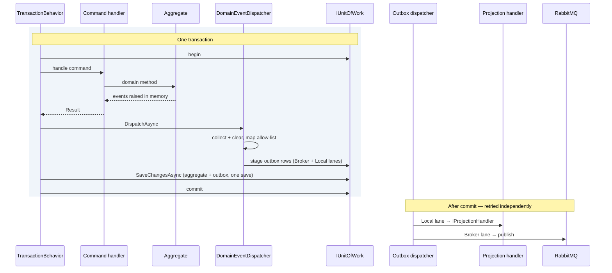

# 7. Persistence

## 7.1 Database per service

Each service owns a SQL Server database. No shared tables, no cross-database
joins, no views into another service's data, no shared read-only user.

For smaller deployments, one SQL Server instance hosting six databases is
acceptable — the isolation that matters is logical. Physical separation is a
scaling and blast-radius decision that can be made later, because nothing in the
code depends on it. Using *schemas* within one shared database instead is the
option to avoid: it makes cross-schema joins possible, and something will
eventually write one.

Each service uses its own SQL login with permissions to its database only. This
turns principle 1 from a convention into something the database enforces.

### Two identities per database

One login is not enough. Each service database has **two** principals with
different rights, used by different processes:

| Identity | Used by | Rights | Rationale |
|---|---|---|---|
| **Runtime** | The API and worker pods | `SELECT`/`INSERT`/`UPDATE`/`DELETE` on every table in the schema — business and technical alike, which §7.4 lists in three rows rather than two: this platform's outbox, inbox and §8.5 markers, **and MassTransit's own** `InboxState`/`OutboxState`/`OutboxMessage`, which ADR-032's saga middleware reads and writes at runtime. **No DDL.** Enumerating only the first row is how a provisioning script undergrants and the saga stops. | The application never alters schema, so it should be unable to. A SQL injection flaw or a compromised pod cannot drop a table |
| **Migrator** | The `*.Migrator` job only | DDL on its own database | Elevated rights exist for the seconds the job runs, in a process with no network listener and no user input |

The grants are the same either way; **how the principal is created is not**,
and the difference is the one that stops a copy-pasted script at the first
semicolon. Managed environments:

```sql
-- Azure SQL / SQL Server with Entra auth: the principal exists in the
-- directory, the database only maps to it. No password anywhere.
CREATE USER [ordering-runtime]  FROM EXTERNAL PROVIDER;
CREATE USER [ordering-migrator] FROM EXTERNAL PROVIDER;
```

Compose, the CI service container, and any SQL Server without a directory behind
it ([§14.1](14-local-development.md)):

```sql
-- Server-level login, then a database user mapped to it. sqlcmd pastes each
-- variable in before T-SQL parses the line, so set both from the vault as
-- environment variables of the same name, never with -v, which puts them on
-- the command line, and generate them without a single quote, which would end
-- the literal.
CREATE LOGIN [ordering-runtime]  WITH PASSWORD = '$(OrderingRuntimePassword)';
CREATE LOGIN [ordering-migrator] WITH PASSWORD = '$(OrderingMigratorPassword)';
GO
USE [Ordering];
CREATE USER [ordering-runtime]  FOR LOGIN [ordering-runtime];
CREATE USER [ordering-migrator] FOR LOGIN [ordering-migrator];
```

```sql
-- Identical from here, and the only part worth reviewing.
-- Runtime: data plane only, and only in the service's schema. Not the
-- database-wide roles: EF keeps its migrations history in dbo, and a runtime
-- that could write it could tell the migrator a pending migration had run.
GRANT SELECT, INSERT, UPDATE, DELETE ON SCHEMA::[ordering] TO [ordering-runtime];

-- Migrator: schema plane, used by the pre-deploy job only.
ALTER ROLE db_ddladmin   ADD MEMBER [ordering-migrator];
ALTER ROLE db_datawriter ADD MEMBER [ordering-migrator];   -- for data backfills
```

> **Do not let local convenience collapse the two keys.** Locally there is one
> `sa` account — [§14.2](14-local-development.md) states the simplification
> and [§12.4](12-test-strategy.md)'s fixture applies
> it — so the *permission* boundary is a cloud-side control, exercised where
> the seeding script above runs. What every local environment exercises is the
> *name* boundary: the migrator reads `ConnectionStrings__OrderingMigrator`
> and the host reads `ConnectionStrings__Ordering`, exactly as in production,
> and the integration suite proves a migrator handed only the runtime key
> refuses to run. Collapsing the keys locally "because they point at the same
> login anyway" is the mistake this callout exists for: the first environment
> where the logins differ then discovers every host reading the wrong name.

This means **two connection strings per service**, held in different secrets and
mounted into different workloads. The migrator's secret is never present in an
API pod. Configuration shape:

```
ConnectionStrings__Ordering           → runtime identity  (API, workers)
ConnectionStrings__OrderingMigrator   → migrator identity (Job only)
```

The split costs one extra secret and pays for itself the first time someone
reviews what an application-tier compromise could actually reach.

## 7.2 EF Core for the write side

`DbContext` is an implementation detail of Infrastructure. Configuration lives
in `IEntityTypeConfiguration<T>` classes, never in attributes on domain types —
attributes would put an EF Core dependency in the Domain project.

**One line in the solution is mapped outside a configuration class, and it is
stated here rather than left to be discovered.** `OrderingDbContext` calls
`modelBuilder.AddTransactionalOutboxEntities()` after the assembly scan, for
the three tables
[ADR-032](adr/ADR-032-the-sagas-outbox-is-masstransits-in-the-sagas-own-transaction.md)
puts behind §9.6's saga. **The scan is not what stops it**, and the reason
matters because the wrong one is easy to state:
`ApplyConfigurationsFromAssembly` looks for types *implementing*
`IEntityTypeConfiguration<T>` in the assembly it is given and says nothing
about where `T` is declared, so an `IEntityTypeConfiguration<InboxState>`
written in `Ordering.Infrastructure` would be found and applied like any other.
What forbids it is **ownership**: MassTransit maps those three entities itself
and its own queries depend on the mapping, so a configuration of ours would be a
second definition of a schema the library has to agree with — and the next
version bump moves the library's half while ours sits there looking correct.
The rule holds for every type this repository defines; §7.4 lists the tables.

`OrderConfiguration.cs` in `Ordering.Infrastructure/Persistence` holds the
whole mapping; this excerpt is part of it.

```csharp
internal sealed class OrderConfiguration : IEntityTypeConfiguration<Order>
{
    public void Configure(EntityTypeBuilder<Order> builder)
    {
        builder.ToTable("Orders", "ordering");
        builder.HasKey(o => o.Id);

        // §11.4's ownership check and §6.5's history query both filter on it by equality (§7.2).
        builder.HasIndex(o => o.CustomerId);

        // By name, never by number, or inserting a member reinterprets every row (§7.2).
        builder
            .Property(o => o.Status)
            .HasConversion<string>()
            .HasMaxLength(20);

        // A private field, so EF has to be told it exists; every line is validated against it (§7.2).
        builder
            .Property<string>("_currency")
            .HasColumnName("Currency")
            .HasMaxLength(3);

        // Optimistic concurrency — SQL Server maintains this automatically.
        builder.Property(o => o.Version).IsRowVersion();

        // A related entity, not an owned collection, so Money maps one way; the boundary is kept by reachability,
        // and IsRequired keeps the schema from admitting an orphan line (§7.2).
        builder
            .HasMany(o => o.Lines)
            .WithOne()
            .HasForeignKey("OrderId")
            .IsRequired()
            .OnDelete(DeleteBehavior.Cascade);

        builder
            .Navigation(o => o.Lines)
            .HasField("_lines")
            .UsePropertyAccessMode(PropertyAccessMode.Field);
    }
}
```

The status is stored by name, never by number: an enum stored as an int makes
the member order a storage contract, so inserting a status in the middle
silently reinterprets every existing row. 20 is the longest member plus room —
`AwaitingPayment` is 15. The order's currency is a private field rather than a
property, so EF has to be told it exists at all; every line is validated
against it and `Total` sums in it, so an order that persists without it
materialises unable to compute its own total. `ShippingAddress` is a value
object mapped as a complex type — columns on the same table, no identity,
exactly matching the domain semantics — and `Total` is ignored, because it is
computed rather than stored.

The lines are a related entity rather than an owned collection, and the reason
is `ComplexProperty`: an owned-collection builder does not offer it, so `Money`
on a line would have to be mapped a second way — two spellings of one value
object in one file, which is the drift the convention block below exists to
prevent. The aggregate boundary is kept by what is absent instead: no
`DbSet<OrderLine>` on the context, and `OrderLine`'s factory internal to the
domain assembly, so a line cannot be reached or made except through `Order`.
Reachability is the rule; the mapping construct is one implementation of it.
The navigation maps the `_lines` backing field, not the public read-only
property.

`CustomerId` is the column §11.4's ownership check reads on every cancellation,
and the one §6.5's history query filters by — both equality on a single
customer, so a plain index over it is the whole requirement. An index is added
by the query that needs it and not in anticipation.

The line's own mapping is a second `IEntityTypeConfiguration`,
`OrderLineConfiguration.cs` beside it, which is what the related-entity
decision above costs — an owned collection would have been configured inline:

```csharp
internal sealed class OrderLineConfiguration : IEntityTypeConfiguration<OrderLine>
{
    public void Configure(EntityTypeBuilder<OrderLine> builder)
    {
        builder.ToTable("OrderLines", "ordering");
        builder.HasKey(l => l.Id);

        // Value object mapped as a complex type — columns on the same table,
        // no identity, exactly matching the domain semantics (§7.2).
        builder.ComplexProperty(
            l => l.UnitPrice,
            price =>
            {
                price
                    .Property(m => m.Amount)
                    .HasColumnName("UnitPriceAmount")
                    .HasPrecision(OrderAmounts.Precision, OrderAmounts.Scale);
                price.Property(m => m.Currency).HasColumnName("UnitPriceCurrency").HasMaxLength(3);
            });

        // Derived on read, not stored.
        builder.Ignore(l => l.LineTotal);

        // The repository's Include seeks by the order, so the foreign key is the index that matters.
        builder.HasIndex("OrderId");
    }
}
```

Global conventions cover what would otherwise be repeated in every file.
`OrderingDbContext` declares them:

```csharp
protected override void ConfigureConventions(ModelConfigurationBuilder configurationBuilder)
{
    configurationBuilder.Properties<decimal>().HavePrecision(OrderAmounts.Precision, OrderAmounts.Scale);
    configurationBuilder.Properties<string>().HaveMaxLength(400);
    configurationBuilder.Properties<DateTimeOffset>().HaveColumnType("datetimeoffset(7)");
}
```

The parameter name is the base declaration's, not a shorter one. CA1725 makes
a rename an error under ADR-019's `TreatWarningsAsErrors`, which is a good rule
here and not a formality: a caller reading the framework's own documentation
for `ConfigureConventions` is reading about `configurationBuilder`.

Unbounded `NVARCHAR(MAX)` columns are a common and avoidable source of both
storage bloat and index limitations; defaulting `string` to a bounded length
turns "someone forgot" into a compile-time-visible override.

## 7.3 Concurrency

Optimistic concurrency is the default and is enough for most aggregates. The
`rowversion` column means a stale write throws `DbUpdateConcurrencyException`,
which the API translates to `409 Conflict` — `ConcurrencyExceptionHandler` in
`Common.Web`, registered for every host by `AddCommonProblemDetails`
([§10.5](10-api-gateway.md)). The response names neither the entity nor the
version it disagreed about: both are storage details, and what the client
needs from this status is only that its copy was stale.

Inventory is the exception. Stock reservation is genuinely contended — the same
SKU may be reserved by many concurrent orders — and optimistic retry loops
degrade badly under that load. There, use a targeted pessimistic update:

```sql
UPDATE inventory.StockItems
SET Available = Available - @Quantity, Reserved = Reserved + @Quantity, UpdatedAt = {Stamp}
OUTPUT inserted.Available, inserted.UpdatedAt
WHERE ProductId = @ProductId
    AND Available >= @Quantity;
```

The `WHERE Available >= @Quantity` makes the check and the decrement a single
atomic statement. If it affects zero rows, there was not enough stock — no read,
no race, no retry loop.

`SqlStockLedger` in `Inventory.Infrastructure/Persistence` owns the statement
as its `TakeSql`, and the `{Stamp}` it interpolates is the ledger's term
rather than this section's. It is monotonic per row rather than a bare clock
read, so two serialised writers leave strictly ordered instants whatever the
server clock does between them, and it is returned beside the level because
it is the `OccurredAt` of the
`StockLevelChanged` that write publishes ([§3.2](03-bounded-contexts.md)). A
bare reading in both places is the version that fails — the second writer can
take an earlier one than the first, and Catalog's projection then keeps the
older level. The guard and the arithmetic above are this section's, and are
what the ledger runs.

## 7.4 Migrations

### What EF generates, and what you write by hand

Two kinds of table live in a service database, and they are authored
differently:

| Kind | Examples | Authored by |
|---|---|---|
| **Write model** | `Orders`, `OrderLines` | The EF model. `IEntityTypeConfiguration<T>` (§7.2) is the source of truth; `dotnet ef migrations add` produces the DDL |
| **Read models and technical tables** | `OrderSummaries`, `ProductPrices`, `OutboxMessages`, `InboxMessages`, `IdempotencyMarkers`, `OrderReviews` | The EF model, though their shape is the chapters' rather than the aggregate's, because they are shaped for queries and index plans rather than for objects. **`ProductPrices` states the terms**: `ProductPriceConfiguration` maps it so `migrations add` emits it beside the aggregate's tables, and is written to produce §6.6's printed types — `char(3)`, `DEFAULT 1` — rather than EF's defaults for the CLR ones. Every table in this row is mapped on the same terms, each by its own configuration. `ordering.Products` (§6.6) belongs in this row and is not built: no configuration or migration creates it. `IdempotencyMarkers` ([§8.5](08-caching-redis.md)) is mapped the same way and for a reason of its own: [ADR-037](adr/ADR-037-the-idempotency-marker-is-a-row-in-the-commands-own-transaction.md)'s store both reads and writes it through the service's `DbContext`, because that is what puts the write inside §6.3's transaction, so the entity has to be in the model whether or not the DDL is emitted from it. The rule is that the shape is the chapter's; which tool writes it is negotiable, and a generated table that drifts from the chapter's DDL is not |
| **A library's own technical tables** | `ordering.InboxState`, `ordering.OutboxState`, `ordering.OutboxMessage` | The EF model, from `modelBuilder.AddTransactionalOutboxEntities()` — **the one stated exception to §7.2's rule that mapping lives in `IEntityTypeConfiguration<T>` classes**, and the exception is about ownership rather than about reach ([ADR-032](adr/ADR-032-the-sagas-outbox-is-masstransits-in-the-sagas-own-transaction.md)). The assembly scan would find a configuration for these entities perfectly well — it selects on the *configuration* type's assembly, not the entity's — but MassTransit maps them itself and queries them on that mapping, so writing one here would be a second definition of a schema the library has to agree with, drifting on its next bump. Their shape is not this blueprint's to specify either, which is the difference from the row above: the rule there is that the shape is the chapter's, and here it is the library's. **Singular, where §9.4's and §9.5's tables are plural** — `OutboxMessage` against `OutboxMessages`, so the two sets share the `ordering` schema without colliding, and a reader of the database sees more messaging tables than the chapters name. **No count on either side of that sentence**: whether §8.5's marker in the cell above is a *messaging* table is the question a numeral here would have to answer, and no chapter does. Ordering is the only service with any of them, because it holds the only saga |

That is why [§6.6](06-cqrs.md) and [§9.4](09-messaging.md) show `CREATE TABLE` and §7.2 does not — the write
model's schema is a projection of the aggregate, and duplicating it as SQL would
create two definitions that drift.

**Both kinds ship in the same EF migration.** There is no second mechanism: the
migrator job runs `Database.Migrate()` and nothing else, so hand-written DDL
that is not inside a migration never executes.

**`Database.Migrate()` and nothing else is also a security boundary, and
[§14.3](14-local-development.md) is what keeps it one.** Development seeding
runs from this same container, behind a gate that fails closed — an explicit
`Seed:Enabled` flag *and* a Development environment name, both read once at the
job host's composition root — because the hook below runs on every production
release holding §7.1's DDL identity.

DDL written by hand rides in a migration beside the EF operations. This one is
the shape `ordering.Products` would arrive in, and is not a file in the tree:

```csharp
public partial class AddOrderingProducts : Migration
{
    protected override void Up(MigrationBuilder migrationBuilder)
    {
        // EF-generated operations for write-model changes appear here.

        // Hand-written DDL rides along, in the same transaction, applied by
        // the same job, versioned by the same migration history.
        migrationBuilder.Sql(
            """
            -- §6.6's product table, in the migration that ships the
            -- ProductPublished handler writing it: Database.Migrate() is the
            -- only mechanism, so nothing else would create it.
            CREATE TABLE ordering.Products ( /* §6.6 */ );
            """);
    }
}
```

`OrderFulfilmentStates` (§9.6) is the one table in both categories: MassTransit's
EF saga repository maps it, so EF can generate it — but the DDL is shown
explicitly because the alert in [§13.6](13-observability.md) and the stuck-saga runbook both query it
directly, and an index nobody declared is an index nobody has.

> **Decision — migrations never run at application startup.** See [ADR-007](adr/ADR-007-migrations-as-a-pre-deploy-job.md).

`Database.Migrate()` in `Program.cs` seems convenient and fails in exactly the
situations that matter: with three replicas starting simultaneously, three
processes race to apply the same migration; with a rolling deploy, old and new
code run against a half-migrated schema; and the application's runtime identity
needs DDL permissions it should not have.

Instead migrations run as a distinct step that must complete before new pods
receive traffic. `_migration-job.tpl` in `deploy/helm/common/templates` renders
it for every chart that owns a database; these are the lines that make it one:

```yaml
apiVersion: batch/v1
kind: Job
metadata:
  name: {{ $jobName }}
  annotations:
    "helm.sh/hook": pre-install,pre-upgrade
    "helm.sh/hook-weight": "-5"
    "helm.sh/hook-delete-policy": before-hook-creation,hook-succeeded
spec:
  backoffLimit: 2
  template:
    spec:
      restartPolicy: Never
      containers:
        - name: migrate
          env:
            - name: ConnectionStrings__{{ .Values.database.connectionName }}Migrator
```

The Job takes the workload's name (§15.3), then `-migrate-` and the image tag.
The chart validates the name's length rather than truncating it: Kubernetes
stamps `job-name` onto the pods it creates and a label value may not exceed 63,
and a cut can end on a character the API server refuses or give two tags one
Job. A tag that does not fit is a deploy that must fail, not a name to mangle.
`hook-succeeded` is in the delete policy as well, or the Jobs accumulate:
`before-hook-creation` matches on name, and the name embeds the tag. A failed
Job is left behind on purpose, because the runbook needs it. The connection
string is the migrator identity (DDL), not the runtime one (§7.1), and its
secret is mounted into no API pod.

Because migrations and application code deploy separately, **every migration
must be backward compatible with the currently running version**. Renaming a
column is therefore a multi-release operation: add the new column, write to
both, backfill, switch reads, stop writing the old one, drop it — one release
per step. This is tedious and it is the price of zero-downtime deploys.

## 7.5 The unit of work and domain event dispatch

**This section is the single normative description of how a domain event becomes
an integration event.** §6.3 shows where it is invoked and §9.3 shows the
translation rules; neither describes a separate mechanism.

Domain events are dispatched inside the transaction that persists the state
change, *after* the handler has finished mutating aggregates and *before*
`SaveChanges` — so that the outbox rows they produce commit atomically with the
state that raised them. **Dispatch stages rows; it runs no handlers** (ADR-018).
Nothing reacts to a domain event until the dispatcher picks that row up after
the commit.

The whole flow, and the only one this document describes: collect → map through
the §9.3 allow-list → stage `Broker` and `Local` outbox rows → one
`SaveChanges` → post-commit reaction driven by §9.4. An in-process handler
writing into the same save is exactly what ADR-018 rejects, because it is how a
transaction acquires a second aggregate, a second service's data, or a deadlock
that only appears under load.

### The collector port

The dispatcher needs to know which aggregates changed, which is EF Core's
change tracker — an Infrastructure concern. Application sees only a port,
declared in `Common.Application`:

```csharp
namespace Common.Application;

public interface IDomainEventCollector
{
    /// <summary>Clears as it collects, so a second call returns only events raised since.</summary>
    IReadOnlyList<IDomainEvent> CollectAndClear();
}
```

Each service that raises domain events implements it over its own context.
Ordering's is `EfDomainEventCollector` in `Ordering.Infrastructure/Persistence`,
and it clears as it collects, so a second call returns only the events raised
since the first:

```csharp
namespace Ordering.Infrastructure.Persistence;

internal sealed class EfDomainEventCollector(OrderingDbContext db) : IDomainEventCollector
{
    public IReadOnlyList<IDomainEvent> CollectAndClear()
    {
        IHasDomainEvents[] aggregates =
        [
            .. db.ChangeTracker
                .Entries<IHasDomainEvents>()
                .Where(e => e.Entity.DomainEvents.Count > 0)
                .Select(e => e.Entity)
        ];

        IDomainEvent[] events = [.. aggregates.SelectMany(a => a.DomainEvents)];

        // Cleared as collected, so a nested dispatch (§6.3) does not stage these a second time.
        foreach (IHasDomainEvents aggregate in aggregates)
            aggregate.ClearDomainEvents();

        return events;
    }
}
```

### The dispatcher

`IDomainEventDispatcher` is the port `TransactionBehavior` calls inside the
transaction, before `SaveChanges`; `IProjectionRegistry` answers whether an
event type has any registered projection handler, so the dispatcher stages no
`Local` row nobody will consume. Both are declared in `Common.Application`, and
`DomainEventDispatcher.cs` there implements the first:

```csharp
namespace Common.Application;

internal sealed class DomainEventDispatcher(
    IDomainEventCollector collector,
    IIntegrationEventMapper mapper,
    IIntegrationEventPublisher publisher,
    IProjectionRegistry projections)
    : IDomainEventDispatcher
{
    public async Task DispatchAsync(CancellationToken ct)
    {
        IReadOnlyList<IDomainEvent> events = collector.CollectAndClear();
        if (events.Count == 0)
            return;

        // Broker lane: allow-listed events become integration events (§9.3).
        foreach (object integrationEvent in mapper.Map(events))
            await publisher.StageAsync(integrationEvent, OutboxLane.Broker, ct);

        // Local lane: only events with a projection handler, since §9.4 throws on a Local row that finds none.
        foreach (IDomainEvent domainEvent in events.Where(projections.HasHandler))
            await publisher.StageAsync(domainEvent, OutboxLane.Local, ct);
    }
}
```

A `Local` row is staged so the projection survives a crash immediately after
commit. `ProjectionRegistry.cs` implements the registry, beside the
`ProjectionRegistryCache` singleton that memoises it, and the registry asks the
container rather than a hand-maintained list:

```csharp
internal sealed class ProjectionRegistry(IServiceProvider services, ProjectionRegistryCache cache)
    : IProjectionRegistry
{
    public bool HasHandler(IDomainEvent domainEvent) =>
        cache.HasHandler.GetOrAdd(
            domainEvent.GetType(),
            type => services.GetServices(typeof(IProjectionHandler<>).MakeGenericType(type)).Any());
}
```

Deriving the registry from the container matters: a `Local` row is staged
**only** when a handler is registered, and §9.4 throws if a staged `Local` row
then finds none. The two checks read the same source, so a handler that is
implemented but unregistered fails at the first assertion rather than becoming
an invisible no-op.

> **`ProjectionRegistry` must be registered scoped**, not singleton. Handlers are
> scoped (§6.2), and `GetServices` for a scoped service from the root provider
> throws *"Cannot resolve scoped service from root provider"*. The cache is safe
> across scopes because DI registrations do not change at runtime — it memoises
> a question about the container's shape, not about any instance.
>
> **Which is exactly why it is a singleton and not a `static` field.** That
> reasoning holds for one container and fails for a process holding several:
> two `WebApplicationFactory` hosts in one test assembly, or a host beside a
> bare `ServiceCollection`, would share whichever answer was computed first. A
> suite proving that an event with no handler stages no `Local` row would then
> poison the suite proving that one with a handler does, in whichever order
> they happened to run. Keyed to the container, the memo still answers a
> question about registrations — which is the property that makes it safe.

Both implementations are internal to `Common.Application`, so a service cannot
register them itself — the registration is an extension method in
`Common.Application/DependencyInjection.cs`, on the same terms as §6.2's
`AddDispatcher()`, and `AddOrderingApplication` (§4.2) calls it:

```csharp
public IServiceCollection AddDomainEventDispatcher()
{
    // Singleton: the memo is keyed to the container, not to the scope that first asked.
    services.AddSingleton<ProjectionRegistryCache>();
    services.AddScoped<IProjectionRegistry, ProjectionRegistry>();
    services.AddScoped<IDomainEventDispatcher, DomainEventDispatcher>();
    return services;
}
```

**A service §4.1 gives no Domain project is the one that registers a
dispatcher of its own.** §4.5's pure-consumer mode renders it — a
`NoDomainEventDispatcher` in the service's Application project that stages
nothing — because §6.3's `TransactionBehavior` still calls a dispatcher, and
the real one needs the collector, mapper and publisher such a service has no
use for. Its premise is a gate rather than a hope: the service's architecture
suite fails the day any type in it implements `IDomainEvent` or
`IHasDomainEvents`, and that day the real dispatcher is owed.

**The dispatcher performs no I/O beyond staging rows.** It does not invoke a
single handler. That is what makes the rest of the design safe.

### Nothing reacts inside the transaction

> **Decision — all reactions to a domain event happen after commit, driven by
> the outbox. Nothing subscribes to a domain event inside the transaction.** See
> [ADR-018](adr/ADR-018-reactions-happen-after-commit.md).

The tempting alternative is to run projection handlers in-process before
`SaveChanges`, so the projection commits atomically with the aggregate. It
fails in three ways, and the third is the one that hurts:

1. **A projection that writes on its own connection is a second transaction.**
   It can commit while the aggregate rolls back — leaving a summary row for an
   order that does not exist — or the reverse.
2. **A projection that writes on the *same* `DbContext` is atomic but not
   retryable.** If the projection has a bug, the command fails. A read model
   defect becomes a write-path outage.
3. **Either version deadlocks.** The handler queries and updates the same tables
   the outer transaction still holds locks on, at exactly the moment those locks
   are held. It works under test and fails under load.

Staging to the outbox and reacting after commit costs a few milliseconds of
staleness and buys durability, independent retry, and no lock contention. The
read model was already eventually consistent ([§2.4](02-architecture-at-a-glance.md)); this makes the lag explicit
rather than pretending it is zero.

### The ordered flow



Stated as rules:

1. Aggregates raise domain events in memory and perform **no I/O**.
2. Command handlers never read `DomainEvents` and never publish anything.
3. `TransactionBehavior` calls the dispatcher **once**, after the handler
   returns successfully and before `SaveChanges`.
4. The dispatcher only **stages outbox rows** — allow-listed events to the
   broker lane (§9.3), events with projection handlers to the local lane.
5. `SaveChangesAsync` persists aggregate changes and outbox rows in **one**
   save; the commit makes both durable together.
6. **Everything else happens after commit**, driven by the outbox dispatcher
   (§9.4) and retried independently of the command that caused it.

Two designs are deliberately rejected:

**No `PendingDomainEvent` table populated by a `SaveChanges` interceptor.** The
interceptor necessarily runs *during* `SaveChanges`, which is too late to
influence that same save, and it duplicates what the outbox already does.

**No in-process domain event handlers.** Domain events are transient signals
within a transaction; the only thing that may consume one is the outbox, which
persists it. If something needs to react, it reacts to a durable row after
commit — not to an in-memory object mid-transaction.

---

[← §6 CQRS](06-cqrs.md) · [Index](README.md) · [§8 Caching →](08-caching-redis.md)
