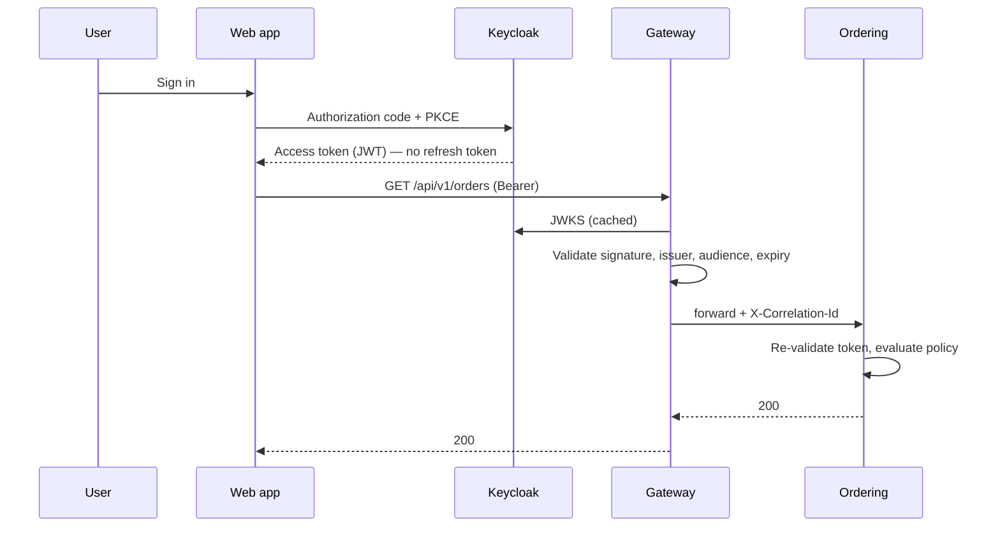
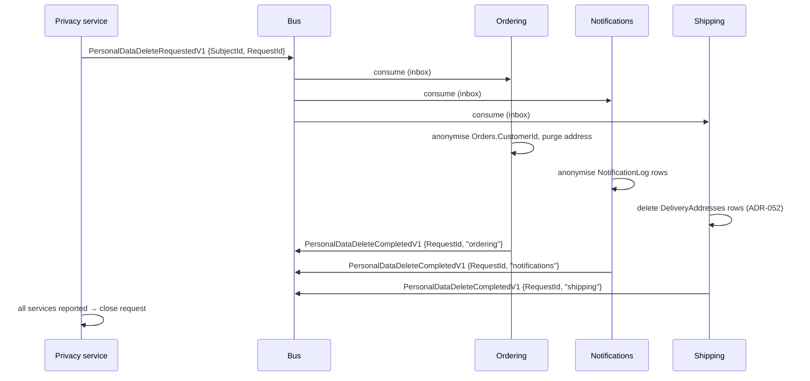

# 11. Identity and authorization

## 11.1 Keycloak as the identity provider

> **Decision — do not build an identity service.** See [ADR-009](adr/ADR-009-keycloak-not-a-hand-built-identity-service.md).

Authentication is a solved problem with a long tail of security-critical detail:
password hashing and rotation, MFA, account recovery, session revocation, token
introspection, brute-force protection, breach detection. Implementing it is a
large amount of work that produces no business differentiation and a great deal
of liability.

> **Two of those are reasons to buy an identity provider, not claims that this
> platform consumes them.** Keycloak revokes a session and offers an
> introspection endpoint; **no service here calls either**. §11.3 configures
> local validation only, so revocation is observed at the next token request
> and not before —
> [ADR-033](adr/ADR-033-revocation-is-bounded-by-the-token-lifetime-and-no-denylist-exists.md)
> records the bounded window that leaves. The list above is the reason the
> problem is not built in-house; it is not an inventory of what is wired up.

Keycloak is used here because it is Apache 2.0, self-hostable, runs as a
container, and speaks standard OIDC. The realistic alternatives:

| Option | Licence | When it fits |
|---|---|---|
| **Keycloak** | Apache 2.0 | Self-hosted, no per-user cost, full control |
| Microsoft Entra ID | Commercial | Already an Azure/Microsoft 365 organisation |
| Auth0 / Okta | Commercial | Willing to pay per-user for lower operational burden |
| Duende IdentityServer | Commercial above a revenue threshold | Deep .NET integration, custom flows |
| OpenIddict | Apache 2.0 | Building the IdP in-process is genuinely required |

Because everything speaks OIDC, swapping providers changes configuration rather
than code.

## 11.2 Token flow



**Services re-validate the token.** The gateway validating it is not sufficient:
anything that reaches a service by another path — a misconfigured network
policy, another service, a port-forward — would otherwise be unauthenticated.
Validation is cheap; assume the network is hostile. Between the listeners,
[§15.3](15-cicd-deployment.md)'s default-deny `NetworkPolicy` narrows who can
reach a service at all
([ADR-065](adr/ADR-065-every-workload-is-fenced-by-a-default-deny-networkpolicy.md)),
where the cluster enforces one; it narrows the path and replaces no check at
either end of it.

> **No refresh token reaches the browser.** Everything `W` is issued is
> readable by any script on the origin, so a refresh token there converts a
> single XSS — or one malicious transitive dependency in the bundle — into
> persistent account takeover that outlives the session and survives a
> password change.
> [ADR-034](adr/ADR-034-the-browser-holds-an-access-token-and-no-refresh-token.md)
> records the decision, and `web-app`'s `use.refresh.tokens: "false"` is what
> enforces it — pinned by `RealmImportTests`, because a realm attribute is
> exactly the kind of setting that gets changed back by someone debugging a
> logout. **In the local realm, and by
> [ADR-042](adr/ADR-042-the-deployed-realm-is-checked-at-deploy-time.md) in a
> deployed one too**: the charts point at an externally provisioned authority,
> which still owes the same attribute, and the rollout reads that realm and
> refuses to roll onto one that does not have it. ADR-034 states the
> obligation; ADR-042 is where it is checked.
>
> **The access-token lifetime beside it is in the same position, and differs
> only in what an unchecked realm costs.** Every host refuses an inbound token
> carrying more remaining life than the bound §11.3 derives
> ([ADR-040](adr/ADR-040-no-host-accepts-a-token-with-more-life-left-than-the-revocation-bound.md))
> — which **bounds** the exposure without reading the realm, since a
> long-lived token is admitted once it approaches expiry. **A refresh token
> affords not even that**: it passes between the browser and Keycloak and
> never reaches a service, so there is nothing at a host to observe it with.
> **Neither is observed at a host and both are observed in the realm**, and
> the distinction is worth keeping: ADR-040 bounds what a token can cost, and
> [ADR-042](adr/ADR-042-the-deployed-realm-is-checked-at-deploy-time.md) reads
> the configuration that issued it. Both settings remain obligations on whoever
> provisions the deployed realm — a repository cannot make somebody else's realm
> correct — but a realm that fails to hold them fails the rollout instead of
> passing unnoticed. Between rollouts the same predicate reads the deployed
> realm on a schedule
> ([ADR-043](adr/ADR-043-the-deployed-realm-is-checked-between-rollouts.md)),
> so a realm edited after a rollout is seen at the next scheduled run —
> nominally within the hour `.github/workflows/realm.yml`'s `schedule` sets,
> and only as reliably as GitHub runs a schedule — rather than at the next
> deploy.
>
> **Continuity is a silent renewal against the authorization endpoint**, bounded
> by the SSO session, so the user sees a login when that session has ended
> rather than when the access token expires. **The residual is an access token,
> and it is stated rather than closed:** an XSS still yields one, which a
> service will accept for up to `RevocationBound`, which §11.3 derives below —
> the lifetime plus the skew, not the lifetime alone, and by ADR-040 a ceiling
> every host enforces rather than a figure it assumes the realm honoured.
> What bounds it is that number and nothing else — there is no
> revocation path
> ([ADR-033](adr/ADR-033-revocation-is-bounded-by-the-token-lifetime-and-no-denylist-exists.md)),
> which is the same fact §11.3 states from the other side.
>
> **Terminating the flow in `Web.Bff` is the stronger answer and is deliberately
> not taken here.** ADR-034 argues why: it is an OIDC handler, a cookie stack,
> antiforgery on every state-changing route, a realm change and a gateway route
> change — an Appendix C row rather than an edit, and §11.5's account of the
> BFF's one client credential would not survive it.

> **The realm also enables `directAccessGrantsEnabled` on `web-app`, and that
> belongs in this chapter rather than only in a realm-file description.** It is
> the password grant, on a public client with no secret, and it exists so a
> developer can obtain a token with `curl` — [§14.1](14-local-development.md)'s
> local affordance, documented in `deploy/compose/README.md`. It is a local
> convenience with a real cost if it ever travelled: anything holding a
> username and password could mint tokens directly, bypassing PKCE and the
> browser flow entirely.
>
> **A deployed realm must turn it off, and a rollout establishes that one
> has** ([ADR-042](adr/ADR-042-the-deployed-realm-is-checked-at-deploy-time.md)).
> It is a requirement rather than a description — this repository owns the
> Compose realm and no other — but the obligation is read at the moment it
> matters, and a deployed realm that keeps the password grant fails the
> deploy. It is read hourly between rollouts as well
> ([ADR-043](adr/ADR-043-the-deployed-realm-is-checked-between-rollouts.md)),
> and a realm that turns the grant back on afterwards files an issue rather
> than waiting for the next deploy.
>
> **This flag is the one the two realms disagree about, and the disagreement is
> the shape of the check.** `RealmImportTests` asserts it *on*, because §14.1's
> documented login is a password grant and a local realm without it makes the
> README's `curl` a lie; the deploy-time check asserts it *off*. Both are right
> about their own realm, which is why `realm_check.py` takes the realm's kind as
> an argument with **no default** — a check that guessed would pass a production
> realm on the local realm's terms, which is this failure wearing the costume of
> its own fix.
>
> **The three settings are checked in the realm because none of them is visible
> at a host.** `standardFlowEnabled` and
> `directAccessGrantsEnabled` decide how a token is *obtained*, and a token that
> arrives at a service does not say which grant minted it; a refresh token
> never arrives at all. What
> [ADR-040](adr/ADR-040-no-host-accepts-a-token-with-more-life-left-than-the-revocation-bound.md)
> reaches is the lifetime alone, and only as a ceiling on remaining life. So the
> configuration is where all three are legible, and
> [ADR-042](adr/ADR-042-the-deployed-realm-is-checked-at-deploy-time.md) reads
> all three there rather than the lifetime alone — at a rollout, and on
> ADR-043's schedule between rollouts, over every deployed workload.

> **A native client is different, and the difference is where the token would
> live rather than what platform it runs on.** ADR-034's refusal is about a
> specific storage: `localStorage`, `sessionStorage`, an in-memory variable —
> anything on `web-app`'s origin, readable by any script that shares it (an
> XSS, a compromised transitive dependency in the bundle) and, because a
> browser's profile is not itself encrypted per origin, by anything with
> filesystem or backup access to the machine it runs on. `mobile-app`'s
> refresh token is written to the Android Keystore or the iOS Keychain
> instead — a store neither web storage nor an in-memory variable has an
> equivalent of, protecting against a different set of attackers: another app
> on the same device, extraction from a filesystem image or a device backup,
> and an attacker who has the device but not the app's own unlocked process.
>
> **What that storage does not protect against is the app's own JavaScript.**
> `mobile-app` authenticates a Capacitor/Ionic hybrid, and the secure-storage
> plugin the app reads the Keystore or Keychain through is itself a
> JavaScript-callable bridge — so a compromised transitive dependency in the
> Angular bundle can call it and read the refresh token out exactly as the
> equivalent dependency could read `web-app`'s out of `localStorage`. The
> Keystore and the Keychain are not an immunity to the threat ADR-034 names;
> they narrow *which* attackers reach the token, from "any script on the
> origin, or anyone with the machine" to "this app's own compromised code,
> and nothing else." That narrower set is still real, and it is the whole of
> why `mobile-app`'s realm attribute is `use.refresh.tokens: "true"` where
> `web-app`'s stays `"false"`:
> [ADR-044](adr/ADR-044-the-native-client-holds-a-refresh-token-and-the-realm-rotates-it.md)
> records the trade in full.
>
> **Rotation is what the native client owes in return, and ADR-044 is where
> the trade and the settings' literal values live — this paragraph states
> what rotation obliges rather than repeating them.** A refresh token becomes
> usable exactly once; presenting one that has already been used does not
> mint another access token, it revokes the session the token belonged to. A
> refresh token copied off a device — a stale backup, another app reading
> this one's Keystore entry through a platform bug — is a token the
> legitimate app has already used or will use next; whichever of the two
> presents it second is refused, and the session both were drawing from ends.
> The setting that does this has no per-client override in Keycloak, so it
> holds for every client holding a refresh token; `web-app` is unaffected, for
> the reason already given above — it holds none for a rotation rule to bind.
>
> **The native client needs a CORS grant as well, for a second hop.** The
> authorization request leaves the app for the
> system browser and returns through `blueprint://auth/callback`, which is
> what `redirectUris` is for. The token exchange is a **second** request, made
> by the app's own page straight to Keycloak, and `webOrigins` is the only
> thing deciding whether the script that made it may read the answer. Keycloak
> grants none by default and OAuth's form encoding is CORS-safelisted, so a
> client declaring no origin does not fail anywhere a log would show it: the
> token is minted, the browser discards it unread, and the authorization code
> is spent. `mobile-app` therefore declares the packaged app's browser origins,
> and `realm_check.py` holds the two clients that exchange a code from a page,
> `web-app` and `mobile-app`, to declaring one — the obligation and not the
> values, because what those origins are is settled by the sibling
> repository's Capacitor configuration rather than here. The service-account
> clients the gate also names run no such exchange and declare none.
> [ADR-046](adr/ADR-046-each-client-declares-a-browser-origin-and-the-gate-asserts-the-shape.md)
> is the decision, as
> [ADR-089](adr/ADR-089-the-browser-origin-obligation-binds-the-clients-that-exchange-a-code-from-a-page.md)
> scopes it; the Compose export is where the literal values live.
>
> This client serves the Angular/Ionic reference client's native build,
> specified in the sibling
> `blueprint-frontend` repository's
> `docs/superpowers/specs/2026-09-10-blueprint-frontend-design.md`, §9
> ("Backend dependency: the `mobile-app` client"), which is also where its
> exact attributes are enumerated.
> [ADR-044](adr/ADR-044-the-native-client-holds-a-refresh-token-and-the-realm-rotates-it.md)
> is the decision the three paragraphs above state, and this section is the
> one it amends.

## 11.3 Service configuration

`AddJwtAuthentication` lives in `Common.Web` and is composed by
`AddCommonWebDefaults` ([§13.2](13-observability.md)), never called directly by
a host. Every service registers it, because every service re-validates (§11.2).
The file is `src/BuildingBlocks/Common.Web/AuthenticationExtensions.cs`, and
two parts of it carry this section's rules. Its constants, among them the two
the bound is composed from:

```csharp
public const string Audience = "commerce-api";

/// <summary>The configuration key the authority is read from (§14.1, §15.4).</summary>
public const string AuthorityKey = "Identity:Authority";

/// <summary>§11.3's access-token lifetime, the larger term of ADR-033's revocation bound.</summary>
public static readonly TimeSpan AccessTokenLifetime = TimeSpan.FromSeconds(300);

private static readonly TimeSpan AllowedClockSkew = TimeSpan.FromSeconds(30);

/// <summary>ADR-033's revocation bound, the most remaining life an inbound token may carry (ADR-040).</summary>
public static TimeSpan RevocationBound => AccessTokenLifetime + AllowedClockSkew;
```

And the bearer options, registered once the authority guard below has refused
anything that is not a usable address:

```csharp
builder.Services
    .AddAuthentication(JwtBearerDefaults.AuthenticationScheme)
    .AddJwtBearer(options =>
    {
        options.Authority = authority;
        options.Audience = Audience;

        // §14.1's Keycloak is served without TLS.
        options.RequireHttpsMetadata = !builder.Environment.IsDevelopment();

        // The default, written out because §11.4's subject rule rests on it (§11.3).
        options.MapInboundClaims = true;

        // ADR-040's control over ADR-033's bound.
        options.Events = new JwtBearerEvents
        {
            OnTokenValidated = context =>
            {
                TimeProvider clock = context.Options.TimeProvider ?? TimeProvider.System;

                // ValidTo's Kind is not contracted, and an Unspecified one would be read as local.
                DateTimeOffset expires =
                    new(DateTime.SpecifyKind(context.SecurityToken.ValidTo, DateTimeKind.Utc));

                if (expires - clock.GetUtcNow() <= RevocationBound)
                    return Task.CompletedTask;

                context.Fail(
                    $"The token has more than {RevocationBound.TotalSeconds} seconds of life " +
                    "left, which is longer than the revocation bound this platform states " +
                    "(ADR-033). Either the realm that issued it sets an access-token " +
                    "lifetime, or a client-level override, above what §11.3 requires — or " +
                    "this host's clock is running behind the issuer's by more than the " +
                    "skew, which makes a conforming token read as a long-lived one. Check " +
                    "the clocks before changing the realm.");

                return Task.CompletedTask;
            }
        };

        // The Validate* flags are written out at their defaults, so the block reads as a checklist.
        options.TokenValidationParameters = new TokenValidationParameters
        {
            ValidateIssuer = true,
            ValidateAudience = true,
            ValidateLifetime = true,
            ValidateIssuerSigningKey = true,

            // Below the framework's default (§11.3).
            ClockSkew = AllowedClockSkew,

            // A display name; the subject stays NameIdentifier (§11.4).
            NameClaimType = "preferred_username",
            RoleClaimType = "roles"
        };
    });
```

The default `ClockSkew` is five minutes, which means an expired token keeps
working for five minutes past its own `exp`. Thirty seconds is enough to absorb
real clock drift between NTP-synced hosts.

**It buys nothing against revocation, and reading it as though it did is the
mistake worth naming.** A lifetime check reads `nbf` and `exp` and nothing
else, so a token the provider revoked a second ago is accepted here until it
expires on its own — at any skew. Observing revocation needs introspection or a
deny list, neither of which this platform has; what bounds the exposure is
token lifetime.

**That lifetime is 300 seconds, and this sentence is where the platform states
it.** Five minutes, normative — not a realm default nobody chose, and not
`ClockSkew`'s coincidentally equal *default* two paragraphs up, which is a
different quantity that happens to share a number.

**It is also a constant, because something reads it**
([ADR-040](adr/ADR-040-no-host-accepts-a-token-with-more-life-left-than-the-revocation-bound.md)).
`AuthenticationExtensions.AccessTokenLifetime` is that declaration, and
`RealmImportTests` compares the shipped realm against the field rather than
against a literal of its own.

**The declaration's shape is a gate input, which is a constraint on
refactoring it.** `deploy/keycloak/realm_check.py` is another reader of that
field, and the one that reads the file's text rather than the compiled
assembly ([ADR-042](adr/ADR-042-the-deployed-realm-is-checked-at-deploy-time.md)):
it anchors on the member's modifier, type and initialiser, and it stops
rather than defaulting unless it finds exactly one. Spelling the lifetime as a
`const int`, moving it into an options record, deriving it from
`RevocationBound`, or dropping the `readonly` therefore leaves every compiler
silent, `realm.yml` red on the pull request that made the change, and
`deploy.yml` refusing every rollout, until the pattern is reconciled in the
same change. The stop is the honest outcome rather than a fragility: a gate
that has lost the number cannot say what a realm owes.

**The revocation window is 330 seconds, and it is the lifetime plus the skew
rather than the lifetime.** `ClockSkew` is 30 seconds here, and a lifetime
check accepts a token until `exp` **plus** the skew — so logging a user out,
disabling a compromised account, or responding to a stolen token at Keycloak
has **no effect** on an access token already issued for up to five and a half
minutes. Two settings decide that number and only one of them is the realm's,
which is why shortening the exposure means reading both.

**That window is held to at every host rather than assumed of the realm.**
`RevocationBound` is `AccessTokenLifetime + AllowedClockSkew` — composed, and
written down as 330 nowhere in the control itself, though
`JwtAuthenticationTests` pins the sum at exactly that once, because a
composition nothing asserts can be recomposed wrongly and still look composed.
Every host that composes `AddCommonWebDefaults`
refuses an inbound token carrying more remaining life than that. The
measurement is remaining life against this host's clock and **not** `exp - iat`:
`iat` is optional in RFC 7519, so an issuer omitting the claim would switch the
control off by omission, and a control any subject can decline is not one.
`ValidTo` is on `SecurityToken` itself, and `exp` is already mandatory here
because `ValidateLifetime` refuses a token without one before the check runs.

**The inexact form costs something, and the ceiling is where that cost is
paid.** A host whose clock lags the issuer's sees a fresh token as having more
life left than it has, so what is refused is life beyond the *bound* — lifetime
plus skew — rather than beyond the lifetime: a realm at 330 seconds passes and
one at 320 passes; five hours, thirty minutes and six minutes do not, which is
the class of misconfiguration this catches. **It is refused
rather than logged**, which is the posture `RequireHttpsMetadata` and the
authority guard below already take — a realm above the bound 401s every request
instead of quietly widening the window between a revocation and its effect, and
that availability cost is taken deliberately.

> **The skew is spent twice, so the window this control admits is 360 seconds
> and not the 330 above.** A token admitted at the ceiling has
> `RevocationBound` left to live, and `ValidateLifetime` then accepts it until
> `exp` plus `ClockSkew` again. **That does not move the bound this section
> states**: for a conforming realm the 330 is produced by the realm's 300 and
> this platform's 30, and the check never binds at all. What the 360 bounds is
> a *non-conforming* token's acceptance, where the alternative was hours.
>
> **Capping the ceiling at the lifetime would make the two equal, and it is a
> knife-edge rather than a tighter bound.** A host whose clock lags the
> issuer's by δ reads a fresh 300-second token as having 300 + δ left, so any δ
> above zero refuses every token a correct realm issues — and the 30 seconds
> that would absorb it is the term the cap removes. The exact form is
> `exp - iat`, declined above, so there is no third value.
> [ADR-040](adr/ADR-040-no-host-accepts-a-token-with-more-life-left-than-the-revocation-bound.md)
> takes the trade and `JwtAuthenticationTests` asserts the sum, so the 360 is
> measured rather than inferred from this paragraph.

[ADR-033](adr/ADR-033-revocation-is-bounded-by-the-token-lifetime-and-no-denylist-exists.md)
records that this bounded window is the accepted posture and withdraws
[ADR-006](adr/ADR-006-redis-for-cache-and-coordination-never-as-a-store-of-record.md)'s
listing of a token denylist among Redis's contents.

> **The number is the whole of the control, so treat it as one.** Lengthening
> `accessTokenLifespan` in the realm silently lengthens the window this
> paragraph quotes, which is why `RealmImportTests` pins the realm's value
> against the figure stated here: two statements about one fact, gated against
> each other rather than left to agree by habit.
>
> **It is also not the realm's only token lifetime, and the other one is
> reachable by a checkbox.** `accessTokenLifespanForImplicitFlow` is 900, and
> the five minutes above is true only because no client enables the implicit
> flow. Turning it on for one client would triple the exposure while every
> number in this chapter still read 300 — the value would not have changed,
> the *path* would — so the suite asserts that no client enables it, alongside
> the lifetime itself. A premise a number depends on is part of the number.
> A client-level `access.token.lifespan` overrides the realm outright, so the
> suite checks for that too.
> **Neither lengthens the window, because the ceiling above does not care
> which setting produced the token** — a 900-second implicit-flow token is
> refused at every host exactly as a 900-second ordinary one is. The suite
> names them anyway: a 401 on every request is a worse way to discover a
> checkbox than a red test is.
>
> **Every one of those checks reads the local realm, and one other check reads
> a deployed one, at a rollout and hourly between rollouts.**
> `RealmImportTests` parses
> [§14.1](14-local-development.md)'s `realm-export.json`; the charts point at an
> externally provisioned authority this repository holds no configuration
> for, and that realm is what
> [ADR-042](adr/ADR-042-the-deployed-realm-is-checked-at-deploy-time.md)'s
> check reads.
>
> **Where a check sits decides what it may hold.** A startup assertion cannot
> read the deployed realm's lifetime, because a discovery document publishes
> none, and committing a production realm would make somebody's operational
> input into this repository's artefact; both are refused. CI holds no admin
> credential to a deployed realm, so the check ADR-042 runs is not in CI but in
> `deploy.yml`'s rollout job, under the `production` GitHub Environment, which
> is the mechanism §15.4 relies on to scope a deployment's secrets.
>
> **What ADR-040 adds is containment rather than verification, and it is
> load-bearing.** Every service validates a token on every request, and a
> token carries how long it has left whatever the realm was configured to do,
> so no host accepts one with more than the bound remaining. That holds
> continuously, where the realm check holds at a rollout and nominally once an
> hour between them
> ([ADR-043](adr/ADR-043-the-deployed-realm-is-checked-between-rollouts.md)) —
> so the two cover different moments rather than one superseding the other:
> the window a drift is live in is bounded by the schedule's cadence rather
> than by the next deployment — an hour only as reliably as GitHub runs a
> schedule — and by this guard for the lifetime's remaining half throughout.
>
> **Containment is weaker than verification, and the difference is worth being
> exact about.** The control
> gates *remaining* life, not the *issued* lifetime: a realm set to five hours
> has its tokens refused for four hours and fifty-four minutes and then
> admitted for the last 330 seconds. That is a large reduction in what a stolen
> token is worth and it is **not** a check of the realm's configuration; that
> check is ADR-042's, and this paragraph is why one is owed. A
> realm edited to 400 fails `RealmImportTests` — which reads the constant the
> control is built from — and, if it were the realm a rollout pointed at, fails
> the rollout as well; without either it would still serve requests in each
> token's final window.
>
> **The refresh-token attribute and the flow flags are invisible at a host and
> legible in the realm, and that asymmetry is why the check reads a realm at
> all.** `use.refresh.tokens`, `standardFlowEnabled` and
> `directAccessGrantsEnabled` decide what Keycloak issues and to whom; a
> refresh token never reaches a service, and the grant that minted a token that
> does reach one leaves no trace in it. No runtime control can observe any of
> the three, which is what
> [ADR-034](adr/ADR-034-the-browser-holds-an-access-token-and-no-refresh-token.md)
> records — and reading the configuration is the one place all three are
> visible, so ADR-042 checks them beside the lifetime rather than instead of it.
>
> **A deployed realm still *owes* those settings, and being checked is not the
> same as being owned.** The division §15.4 draws for every Secret holds: the
> charts create no Secrets and provision no realm, so the identity provider
> remains somebody's operational input. That input is inspected before it is
> deployed onto, which is a smaller claim than owning it and a bigger one than
> stating it.

**The authority is read eagerly and the throw names the key**, which is the
posture `AddSqlServer` and `AddMassTransitMessaging` already take: a host that
cannot name its identity provider does not start, and what it throws is an
`InvalidOperationException`, not an `OptionsValidationException`. It is
deliberately **not** an options type with `ValidateOnStart`: the eager read
already refuses at start, which is what [§15.4](15-cicd-deployment.md) asks of
a required key, and a bag bound to a section holding one value would validate
nothing the read does not.

The read refuses four values. A blank one counts as missing, because an
environment variable set to the empty string reaches configuration as `""`
rather than null, so a null check alone admits `Identity__Authority=`. A value
that is not an absolute http or https URL is refused, since
`keycloak:8080/realms/commerce`, with its scheme dropped, is non-blank and still
not an address. A query or fragment is refused, because the well-known
discovery path is appended to the authority and a fragment would swallow it.
And plain HTTP is refused outside Development, which is `RequireHttpsMetadata`'s
rule moved to startup.

**The audience is a constant, not configuration.** §11.5 settles on one
audience for the whole platform — per-service audiences are a later split — so
the value is identical in Compose, in the test fixture and in production, which
is exactly what §15.4 says disqualifies something from being configuration.
Being a constant is also what makes the realm checkable: the suite that reads
the shipped realm compares its audience mapper against this field rather than
restating the string.

> **`RequireHttpsMetadata` is the line the rest of this block rests on.** The
> four `Validate*` flags check a signature against keys fetched from the
> authority's discovery document — over plain HTTP, an attacker who can rewrite
> that response supplies their own keys and every check below passes on a token
> they minted. §14.1's Keycloak is `http://keycloak:8080`, so Development has to
> allow it; anything that is not Development must not, and the test asserts both
> directions rather than only the one somebody remembered to name.

## 11.4 Permission-based authorization

Role checks scattered through controllers (`[Authorize(Roles = "Admin")]`)
become unmaintainable once roles multiply. Authorize on **permissions**, and map
roles to permissions in one place.

The permission strings are the contract with the realm's claim mapper (§11.5);
the policies registered from them are how ASP.NET Core checks them. Ordering's
registration is in `src/Services/Ordering/Ordering.Api/Program.cs`:

```csharp
// RequirePermission, so the claim type is PermissionClaim.Type's alone (§11.4). No orders:admin policy: that string
// is a claim CancelOrderHandler checks against a loaded aggregate.
builder.Services
    .AddAuthorizationBuilder()
    .AddPolicy(OrderingPermissions.Write, p => p.RequirePermission(OrderingPermissions.Write))
    .AddPolicy(OrderingPermissions.Cancel, p => p.RequirePermission(OrderingPermissions.Cancel))
    .AddPolicy(OrderingPermissions.DeliveryAddress, p => p.RequirePermission(OrderingPermissions.DeliveryAddress));
```

One policy per constant and no more: a policy registered before an endpoint
names it is an unused registration, which is the mirror of the unregistered
name the callout below is about. The constant class and the registration gain
and lose an entry together.

`RequirePermission` is an extension in `Common.Web` over
`RequireAuthenticatedUser()` and then `RequireClaim(PermissionClaim.Type,
permission)` — the first because `RequireClaim` alone evaluates whatever claims
the principal carries and asks nothing about whether anything authenticated
it, so without it a principal that happens to carry the claim would be
authorised unauthenticated. It exists so that **no host ever spells the claim
type**: four things have to agree on `"permission"` and
only three of them are code — the policies here, `ICurrentUser.HasPermission`
below, the test authentication scheme ([§12.4](12-test-strategy.md)), and the
realm's protocol mapper, which is configuration and cannot reference a
constant. The fourth is asserted against the other three instead (§11.5).

The permission strings are a per-service constant class rather than literals,
for the reason the next callout gives: a name written twice is a name that can
be misspelt once. It lives at the composition root, beside the policies —
`Ordering.Api`, and `Gateway.Api` for the gateway's own `inventory:admin`
(§10.2). Ordering's is
`src/Services/Ordering/Ordering.Api/OrderingPermissions.cs`:

```csharp
public static class OrderingPermissions
{
    public const string Write = "orders:write";
    public const string Cancel = "orders:cancel";
    public const string DeliveryAddress = "orders:delivery-address";
}
```

**A service's vocabulary holds what its endpoints require, and nothing else.**
There is no `orders:read`, because nothing in Ordering requires it; the
constant follows the endpoint, and arrives with whichever change gives
Ordering an endpoint that names it. A permission printed here ahead of the
endpoint that names it would be the first half of the rule below.
Catalog's is one entry — `catalog:write` — because its listing is anonymous
([§10.2](10-api-gateway.md)); there is no `catalog:read`, because a permission
nothing requires is a name in the realm nobody can act on. `orders:admin` is
not here either, and for a different reason given below: it is a **claim** a
handler checks, not a policy an endpoint names.

**The rule runs both ways, and the second direction is the one that gets
missed.** A permission nothing requires is a dead name in the realm; a
permission something requires and the realm cannot grant is a **path nobody
can reach** — 403 for every principal Keycloak can issue, at every attempt,
for ever. So the role in §11.5's `commerce-api` client and the constant here
arrive in the same change, whichever of the two is written first. **A route's
permission is under the same rule as an endpoint's**, and neither the constant
nor the closed-set realm test sees a breach of it: the constant makes a
*misspelling* a compile error and says nothing about a name the identity
provider has never heard of, and the realm test compares against a literal
because `Common.Web.Tests` is a building block's suite and cannot reference a
host to read its constants. The check belongs to whichever suite owns the
constant, which is where `GrantablePermissionTests` sits in
`Gateway.Api.Tests`, `Catalog.Api.Tests`, `Ordering.Api.Tests`,
`Inventory.Api.Tests` and `Payments.Api.Tests`.

> **A policy name is a reference, and nothing checks it.**
> `RequireAuthorization("orders:cancel")` takes a string. Misspell it, or
> register the policy in a helper the host never calls, and there is no
> compiler error, no `ValidateOnBuild` failure and no startup warning — the
> endpoint throws `InvalidOperationException` the first time somebody cancels
> an order, which is to say in production, on the path that matters.
>
> **The gateway is the one place this fails better.** YARP validates both
> registries when it loads §10.2's file and refuses to start, naming the
> policy and the route. So the deployment fails, and nothing serves a request
> under a policy that does not exist. A service still has the failure described
> above, which is what the rest of this callout is for.
>
> This is the `GetServices<T>()` problem in a different costume — a lookup by
> name that returns nothing and is only observed at the call site. Assert it
> the same way: enumerate the endpoint policy names from
> `EndpointDataSource` in a test and require each to resolve through
> `IAuthorizationPolicyProvider`.
>
> **A constant closes half of this and the test closes the other half**, which
> is why both are wanted. Naming the policy from a per-service `Permissions`
> class makes a misspelling a compile error; it says nothing about a policy
> that was never registered, because the constant is equally happy on both
> sides of a registration that does not run. The enumeration is what catches
> that, and it needs its own guard against passing vacuously — over a service
> with no endpoints, "every name resolves" is true and worthless.

**The mirror case is the one with no diagnostic at all, and a fallback policy
is what closes it.** The callout above is about a policy *named* and not
registered. A policy neither named nor required is quieter still:
`UseAuthorization` evaluates **nothing** on an endpoint carrying no
authorization metadata, so authorization applies exactly where somebody wrote
`RequireAuthorization()` and nowhere else — no compiler error, no
`ValidateOnBuild` failure, no startup warning, and no test that would notice.
The endpoint is then reachable from the internet rather than merely from
inside the cluster, since [§10.2](10-api-gateway.md)'s public route is GET-only
across a whole namespace.

`AddCommonWebDefaults` therefore sets a fallback
([§13.2](13-observability.md),
[ADR-030](adr/ADR-030-authorization-is-deny-by-default-in-the-building-block.md)):

```csharp
builder.Services
    .AddAuthorizationBuilder()
    .AddPolicy("authenticated", p => p.RequireAuthenticatedUser())
    .SetFallbackPolicy(new AuthorizationPolicyBuilder().RequireAuthenticatedUser().Build());
```

Every host composing that call inherits it, so the omission is a 401 and a
public path has to say `AllowAnonymous()` — a line a reviewer can see. Absence
and decision stop looking the same, which is the rule §10.2 already applies to
a route file and §13.5 to a readiness set.

> **A fallback reaches endpoints nobody wrote, and the three it reaches here
> are all deliberate.** Routing's 405 short-circuit endpoint carries no
> metadata, so an anonymous caller using the wrong method on a real path is
> challenged before the method is considered — an authenticated one still gets
> 405. `MapOpenApi()` carries none either, so the document that enumerates
> every route and schema requires a caller. And the policy is evaluated
> when routing matched *nothing*, so an anonymous request for a path that does
> not exist is a 401 rather than a 404; an authenticated one still gets the
> 404. All three follow from §11.2's posture rather than from this mechanism,
> and each is pinned by a test asserting the admitted half as well as the
> refused one — a 401 on its own passes against a host that has stopped
> routing altogether.

**It does not replace the enumeration test above, and neither replaces the
other.** The fallback is at the request; the test is at build time and names
the endpoint that has no policy. What the fallback adds is that the answer does
not depend on anyone having written the test — which matters most for each new
service §4.5's scaffold renders.

> **Decision — Minimal APIs, not MVC controllers.** See
> [ADR-015](adr/ADR-015-minimal-apis-not-mvc-controllers.md). The endpoint layer in this
> architecture is a thin translation from HTTP to a command or query. Controllers
> add a base class, attribute routing, model binding conventions and an action
> filter pipeline to do that, and their filter pipeline duplicates the dispatcher
> pipeline that already exists. Minimal APIs express the same thing with less
> ceremony, and endpoint groups give the same route and policy grouping.

The cancel endpoint is in
`src/Services/Ordering/Ordering.Api/Endpoints/OrderEndpoints.cs`, whose route
group calls `RequireAuthorization()`, so a later endpoint inherits
authentication rather than arriving open. `CustomerReason` is the wire code
`CancellationReasons.ToCode` gives `CancellationReason.CustomerRequest`:

```csharp
// A request record, since the reason is parsed here and the origin is not the caller's to state (§11.4).
group
    .MapPost(
        "/{id:guid}/cancel",
        async (
            Guid id,
            CancelOrderRequest request,
            IDispatcher dispatcher,
            CancellationToken ct) =>
        {
            if (!CancellationReasons.TryParse(request.Reason, out CancellationReason reason))
            {
                return Results.ValidationProblem(
                    new Dictionary<string, string[]>
                    {
                        [nameof(request.Reason)] = ["Not a known cancellation reason."]
                    });
            }

            // Every other code is a fact only the workflow can state; from a caller it is a claim nobody
            // checks, recorded on the order and counted on orders.cancelled (ADR-087).
            if (reason != CancellationReason.CustomerRequest)
            {
                return Results.ValidationProblem(
                    new Dictionary<string, string[]>
                    {
                        [nameof(request.Reason)] =
                        [
                            $"A caller cancels with {CustomerReason}; the other reasons are the workflow's."
                        ]
                    });
            }

            Result result = await dispatcher.SendAsync(
                new CancelOrderCommand(id, reason, CommandOrigin.User),
                ct);

            return result.ToHttpResult();
        })
    .RequireAuthorization(OrderingPermissions.Cancel)
    // Order.Cancel returns on a cancelled order, and cancelled is terminal (§5.4).
    .RetrySafe(RetrySafety.Convergent)
    .WithRequestExample(new CancelOrderRequest(CancellationReasons.ToCode(CancellationReason.CustomerRequest)))
    .WithName("CancelOrder");
```

Endpoint classes reference Application and Domain contracts only — never
`DbContext`, a concrete repository, or the bus. That is the composition-root
rule from [§4.2](04-solution-structure.md), and it is enforced by an architecture test rather than review.

The request type carries the **wire code**, not the enum, for the reason [§9.4](09-messaging.md)
gives about `CancelOrder.Reason` — and the parse is the same one, because two
parses drift and the drift only shows on whichever path is less tested.
Binding `CancellationReason` straight from JSON would publish the enum's
member names as API surface, and an unknown value would surface as a
model-binding error rather than a 400 naming the field.

`CancelOrderRequest(string Reason)` is declared at the foot of
`OrderEndpoints.cs`, beside the endpoint that binds it, not in the slice, and
the reason is
that this handler has **two** entry paths with two wire shapes. The message
path's shape is `CancelOrder` in `Common.Contracts` (§9.4); if the HTTP path's
shape sat in `Ordering.Application`, the slice would own one transport's
request type while the other's lived in a different assembly, for no reason
either side could state. Each transport owns its own wire type, and the slice
owns only the `CancelOrderCommand` both converge on, in
`src/Services/Ordering/Ordering.Application/Orders/CancelOrder/CancelOrderCommand.cs`:

```csharp
public sealed record CancelOrderCommand(
    Guid OrderId,
    CancellationReason Reason,
    CommandOrigin InitiatedBy) : ICommand<Result>
{
    /// <summary>The trusted path, a positive claim rather than the absence of a principal (§11.4).</summary>
    public bool IsSystemInitiated => InitiatedBy is CommandOrigin.System;
}

/// <summary>Who asked, written as a literal at each entry point and never bound from a request (§11.4).</summary>
public enum CommandOrigin
{
    /// <summary>An HTTP request with a principal; the ownership check applies.</summary>
    /// <remarks>The zero value, so an origin nobody set fails closed (§11.4).</remarks>
    User,

    /// <summary>§9.6's saga compensating, already authorised at the endpoint that started it.</summary>
    System
}
```

Its result is the non-generic `Result`, because `CommandConsumer` constrains
`TCommand` to `ICommand<Result>` (§9.4) and a command reachable by message must
satisfy it. `InitiatedBy` is not bindable from the request:
`CancelOrderRequest` does not carry it, and each entry point passes a literal —
the endpoint `CommandOrigin.User`, the message mapper `CommandOrigin.System`
(§9.4). A field a caller could set would be the fail-open the origin exists to
close, wearing a different name.

`CancellationReasons`, in
`src/Services/Ordering/Ordering.Application/Orders/CancellationReasons.cs`, is
the one place a wire code becomes the domain enum, and both entry points call
it:

```csharp
private static readonly FrozenDictionary<string, CancellationReason> ByCode =
    new Dictionary<string, CancellationReason>(StringComparer.Ordinal)
    {
        [CancelReasons.OutOfStock] = CancellationReason.OutOfStock,
        [CancelReasons.StockTimeout] = CancellationReason.StockTimeout,
        [CancelReasons.PaymentDeclined] = CancellationReason.PaymentDeclined,
        [CancelReasons.PaymentTimeout] = CancellationReason.PaymentTimeout,
        [CancelReasons.CustomerRequest] = CancellationReason.CustomerRequest
    }.ToFrozenDictionary();

public static bool TryParse(string? code, out CancellationReason reason) =>
    ByCode.TryGetValue(code ?? "", out reason);
```

The map is ordinal over the contract's codes, so `"CustomerRequest"`, the
member's name, is not one; `Enum.TryParse` over the member names would accept
it and make the enum's spelling part of the API. Both callers refuse an
unknown code, differently, because their callers differ. The endpoint returns
400 naming the field, because a person can fix a request. The message mapper
throws `ContractMappingException`, which §9.4's retry policy ignores so the
message reaches the error queue on the first attempt — a sibling service
sending a code Ordering does not know is a deployment problem, and no amount of
backoff resolves it. `ToCode` inverts the same map rather than writing a second
table. `CancellationOrigins`, beside it, maps one way only: nothing parses an
origin, because no ingress accepts one, and a `TryParse` there would be the
first door onto a value a caller could claim.

Coarse permission checks live at the endpoint. **Resource-level checks — "is
this the customer's own order?" — belong in the handler**, where the data is
available. The body of `HandleAsync` in
`src/Services/Ordering/Ordering.Application/Orders/CancelOrder/CancelOrderHandler.cs`,
up to the commit that `TransactionBehavior` owns (§6.3):

```csharp
Order? order = await orders.GetAsync(new OrderId(command.OrderId), ct);
if (order is null)
    return Result.Failure(OrderErrors.NotFound);

// A 404 rather than a 403, which would confirm the order exists. "orders:admin" is a claim checked against
// a loaded aggregate, not one of OrderingPermissions' policies (§11.4).
if (!command.IsSystemInitiated &&
    (!currentUser.IsAuthenticated ||
        (order.CustomerId.Value != currentUser.Id &&
            !currentUser.HasPermission("orders:admin"))))
{
    return Result.Failure(OrderErrors.NotFound);
}

// Anything not provably the workflow is User, so the saga faults rather than discards (§9.6, §11.4).
CancellationOrigin origin = command.InitiatedBy switch
{
    CommandOrigin.System => CancellationOrigin.Workflow,
    _ => CancellationOrigin.User
};

// The aggregate owns the transition (§5.4); its refusal past despatch is a 422, not a 500.
try
{
    order.Cancel(command.Reason, origin, clock.GetUtcNow());
}
catch (DomainException)
{
    return Result.Failure(OrderErrors.AlreadyShipped);
}
```

> **`CancelOrderHandler` is `public`, and it is the §6.2 scan that decides
> this rather than taste.** `AddClasses` scans public classes only, so an
> `internal` handler is skipped in silence. Nothing resolves an open generic
> at build time, so `ValidateOnBuild` passes and the dispatcher throws on the
> first request that needs the handler. A handler is a registration target,
> and its accessibility is part of the contract with the scanner.

The requirement behind `InitiatedBy` is real. `CancelOrderCommand` is dispatched
from two places — the endpoint above and a `CommandConsumer`
([§9.4](09-messaging.md)) when the saga compensates — and the second has no
caller. A message-borne cancellation is the system acting on its own decision,
already authorised at the endpoint that started the saga; checking it against
"the current user" would compare an order's owner to nobody and refuse every
compensation. Handlers reachable both ways must say which check applies to
which path.

> **An absent principal is not a system origin.** A check that opened with
> `currentUser.IsAuthenticated &&` would be false whenever no principal was
> present, and the handler would go on to cancel any `OrderId` the caller
> named. That reads as a guard and behaves as an exemption: it uses an
> *ambient absence* — no `HttpContext` — as a proxy for "this came from the
> saga", and those are not the same proposition. Anything reaching the
> handler without a principal would inherit owner privileges, which is the
> condition an attacker arranges rather than avoids. The origin makes the
> trusted path a statement the caller cannot make, and the check fails closed
> when neither an owner nor a stated system origin is present.

Where the second path is a *different operation* rather than the same one from
elsewhere, prefer a second command type over a second origin — the trusted path
is then the type system's problem rather than a field's. `InitiatedBy` is right
here because compensation cancels an order in exactly the sense the customer
does; §9.6's saga wants the same transition, not a parallel one.

**The two paths are symmetric on the way in and not on the way out.** The
saga that sends its own `CancelOrder` finalises once both its stock and its
payment have come to rest, which [§9.6](09-messaging.md) says when. The endpoint
above cancels the aggregate and ends nothing — it is the saga's
*subscription* to `OrderCancelled` (§3.2, §9.6) that stops the
workflow; without it a customer who cancelled here would keep stock reserved
and a card authorised. Nothing on this page depends on that subscription,
which is the point worth carrying: an endpoint that publishes a fact has
discharged its obligation, and whether anybody is listening is the other
chapter's.

The port, `src/BuildingBlocks/Common.Application/ICurrentUser.cs`:

```csharp
/// <summary>The caller behind the operation, as a port, so no handler sees <c>HttpContext</c> (§11.4).</summary>
public interface ICurrentUser
{
    /// <summary>False for an anonymous request and for a message-borne command alike.</summary>
    bool IsAuthenticated { get; }

    /// <summary>Throws, rather than returning <see cref="Guid.Empty"/>, when there is no subject.</summary>
    Guid Id { get; }

    /// <summary>Reads the claim the endpoint policies read (§11.4).</summary>
    bool HasPermission(string permission);
}
```

And its one implementation,
`src/BuildingBlocks/Common.Web/HttpContextCurrentUser.cs`, which
`AddCommonWebDefaults` (§13.2) registers scoped, beside
`AddHttpContextAccessor()`:

```csharp
/// <summary>§11.4's one implementation of <see cref="ICurrentUser"/>, over the request's principal.</summary>
public sealed class HttpContextCurrentUser(IHttpContextAccessor accessor) : ICurrentUser
{
    /// <summary>The caller's authenticated identities and nothing else, so no claim is read from another.</summary>
    /// <remarks>Filters identities rather than testing the principal, as <c>FindFirst</c> reads all (§11.4).</remarks>
    private ClaimsPrincipal? Caller
    {
        get
        {
            ClaimsIdentity[] authenticated =
                [.. accessor.HttpContext?.User.Identities.Where(i => i.IsAuthenticated) ?? []];

            return authenticated.Length == 0 ? null : new ClaimsPrincipal(authenticated);
        }
    }

    public bool IsAuthenticated => Caller is not null;

    /// <summary>Where Keycloak's <c>sub</c> lands under the inbound claim mapping (§11.3).</summary>
    public Guid Id => Guid.Parse(
        Caller?.FindFirstValue(ClaimTypes.NameIdentifier) ??
            throw new InvalidOperationException(
                "No subject. Either there is no authenticated caller — guard with " +
                "IsAuthenticated, since a handler reached by a consumer (§9.4) has no " +
                $"HttpContext — or the principal carries no '{ClaimTypes.NameIdentifier}'. " +
                "That second case has two causes and they are in different components: " +
                "the identity provider is not issuing 'sub' (§11.5), or MapInboundClaims " +
                "is off and the raw 'sub' was never translated (§11.3)."));

    public bool HasPermission(string permission) =>
        Caller?.HasClaim(PermissionClaim.Type, permission) == true;
}
```

> **Claims and authentication are independent, so the gate belongs in one
> place rather than in each member.** A `ClaimsIdentity` built with no
> authentication type carries whatever claims it was given and still reports
> `IsAuthenticated` false; a member reading `HttpContext.User` directly would
> therefore answer a subject and grant a permission for a principal this
> interface says is not a caller. Routing all three through one authenticated
> projection is what makes the contract above true rather than merely
> documented.
>
> **Filtering the identities is not the same as testing the principal, and the
> difference is a hole.** `ClaimsPrincipal.Identity` returns the **primary**
> identity, while `FindFirst` and `HasClaim` search **every** identity the
> principal holds — so `User is { Identity.IsAuthenticated: true }` passes on
> an authenticated first identity and then reads claims from an unauthenticated
> second one. Any host authenticating over two schemes can produce that
> principal, and `AddIdentity` produces it in one line. The projection above
> keeps only the identities that answer for themselves.

> **Both types are common, not per-service, and the paths above say so.**
> Nothing in either type names a service: the port has three members about a
> principal, and the implementation reads `HttpContext`.
>
> The implementation could not go in `Common.Infrastructure` even if one wanted
> it there. That project takes no `FrameworkReference`, and
> `IHttpContextAccessor` arrives with one — `Common.Web` is the only building
> block that has it, which is the same argument that keeps §13.2's middleware
> there. Registering the pair in `AddCommonWebDefaults` then follows from what
> that helper is for: every host that authenticates has a current user, and the
> accessor must be registered beside it or `ValidateOnBuild` fails rather than
> the first ownership check.

**Three places have to agree on which claim identifies a user**, and they do:
`ClaimTypes.NameIdentifier` here, in §10.3's rate-limit partition key, and in
the `TestAuthHandler` of [§12.4](12-test-strategy.md).

> **A fourth thing has to agree, and it is a setting rather than a place.**
> Keycloak issues `sub`; everything above reads `NameIdentifier`, and
> `MapInboundClaims` is the only thing that turns one into the other. §11.3
> writes it out rather than inheriting the framework default, because nothing
> else in the platform would notice it changing: a realm test proves the token
> carries `sub`, and a unit test over an injected principal starts from a
> `NameIdentifier` that is already there. Both stay green while every
> authenticated request throws on a perfectly valid token. The end-to-end
> assertion belongs in the one suite that starts from a signed token.

`NameClaimType = "preferred_username"` in §11.3 does **not** compete with this.
It sets what `ClaimsPrincipal.Identity.Name` returns — a display name, for logs
and audit lines — while `NameIdentifier` stays the stable subject identifier.
Reading `Identity.Name` as the key to a record would work in every test and
break the first time somebody changed their username.

`orders:admin` is a **claim**, not one of §11.4's registered policies. Policies
gate endpoints; a resource check asks a question the endpoint could not have
answered before loading the data. The permission strings come from the same
vocabulary either way.

### The subject rule

> **A subject identifier is bound from the principal, never from the request.**
> On any operation that arrives with a principal behind it — every HTTP command
> and query in this blueprint — `ICurrentUser.Id` is the only source of "whose
> order is this". A `CustomerId` sitting in a command record, a query record, a
> request DTO or a query string is a field any authenticated caller sets to
> somebody else's subject, and no validator catches it, because `NotEmpty()` is
> true of another customer's GUID.

> **The message path is covered too, and the rule there is one word
> different: re-derived, never bound.** A command arriving over the broker has
> no principal at all — the sending service is the caller — so there is nothing
> for `ICurrentUser` to answer with, and binding is not available. What
> [ADR-028](adr/ADR-028-a-money-movement-command-carries-no-subject.md)
> settles is that this does not license carrying the subject as a field
> instead: **the service that owns the decision resolves the subject from its
> own record**, built from an event whose subject *was* bound from a principal.
> §9.6's `AuthorisePayment` accordingly carries no `CustomerId` at all, and
> Payments resolves the payer from the `OrderPlaced` it consumes ([§3.2](03-bounded-contexts.md)).
>
> **What decides which fields may stay is instruction versus authority.**
> `Amount` and `Currency` remain on that command because they are what to do:
> the sender decides them, and Payments may refuse a mismatch against its
> record as a consistency check. The subject is on whose behalf, and that is
> the deciding service's to derive — a transported authority is a second source
> for a decision that must have exactly one, and a check that exists is not a
> check that is performed.
>
> **The distinction is not checkability.** Payments' record holds the payer as
> well as the total, so a supplied `CustomerId` would be as checkable as the
> amount; the record §3.2 requires is what refutes that reading. The argument
> that stands is the stronger one: the field that is absent cannot be the one a
> later code path reads instead of the record.
>
> **Leaving the subject off narrows what a forged command does.** Because
> `AuthorisePayment` **alone** does not carry the payer, a forged one naming a
> real order re-triggers that order's own authorisation rather than
> redirecting one at a customer of the sender's choosing. The ability to
> publish it is itself scoped
> ([ADR-036](adr/ADR-036-the-broker-has-a-per-service-identity.md)) —
> `payments-commands` is writable by the services whose own source addresses
> it, and by nobody else.
>
> **Payer selection is not gone, and saying it was is the overclaim this
> callout has to avoid.** A principal able to publish both could forge the
> `OrderPlaced` that seeds Payments' record and then send the command, which
> selects a payer in two messages rather than one. The gain is cost and
> visibility rather than capability — the added message is an event
> Ordering's own saga and Notifications both consume, so it starts a
> fulfilment saga for an order the write model has no row for and tells a
> customer about an order they never placed. **Per-service broker identity is
> what closes it, and
> [ADR-036](adr/ADR-036-the-broker-has-a-per-service-identity.md)
> is that**: forging the seeding `OrderPlaced` needs `write` on
> `Common.Contracts.Ordering.V1:OrderPlaced`, which only Ordering's account
> holds. This rule does not close it, and does not have to.

This is one rule with three consequences, and the worked slices show all three:
`PlaceOrderCommand` ([§6.4](06-cqrs.md)) carries no `CustomerId` and its handler
reads `currentUser.Id`; `GetOrderSummariesQuery` (§6.5, rewritten in §6.6)
carries none either, so the `WHERE` clause cannot be pointed at another
customer; and `CancelOrderHandler` above resolves ownership against the loaded
aggregate rather than against anything the caller sent.

**The rule reaches past record fields** — §10.3's rate-limit partition key,
named above, is already one — **and [§8.5](08-caching-redis.md) is where
getting it wrong costs the most.** An idempotency key is not a field on
anything either, and it is built from a client-generated `CommandId` — so a key
that names only the command type and that value is one any caller can claim on
another's behalf. It is
therefore scoped by `ICurrentUser.Id` for the same reason `PlaceOrderCommand`
carries no `CustomerId`. The consequence of getting it wrong is sharper there
than here: the replay branch returns a stored result **without running the
handler**, so the subject is never bound from the principal at all. The gate in
front of it still runs — authentication and the endpoint's policy happen before
the dispatcher — which is what makes the failure quiet: a genuine authenticated
caller, correctly admitted, handed a record the rule above exists to keep from
them.

**The absence is the mechanism.** Keeping the field and checking it in the
handler — `command.CustomerId != currentUser.Id → Result.Failure` — is sound
where it is written and is one omission away from an IDOR in every slice copied
from it. A field that does not exist cannot be forgotten, and the read path is
where forgetting is most expensive: §6.5 returns a page of another customer's
history rather than a single record.

Two cases genuinely need something other than the caller's own subject, and both
are explicit rather than incidental. An administrator acting for a customer is a
**separate command** carrying the target subject, with its own registered
endpoint policy and an `orders:admin` claim check in the handler — it is a
different operation and reads as one. And a handler reachable by message has no
principal at all, which `InitiatedBy` above answers: the subject comes off the
aggregate, and the origin says why no check applies.

**Overriding ownership is not the same as naming a subject**, and
`CancelOrderHandler` above does the first without breaching the rule. Its
`HasPermission("orders:admin")` branch admits an administrator to an order the
caller has already identified by `OrderId`, and the owner it compares against is
read off the loaded aggregate rather than off the command — so nothing in the
request says whose order it is. Naming somebody else's subject is what needs a
second command type; relaxing the ownership test on an operation that is
otherwise identical is a claim check on the same one.

**`orders:admin` is a claim, and the admin command's endpoint policy is a
separate thing that happens to require it.** The two are easy to collapse
because this chapter's policy names read like claim names — the
`OrderingPermissions` constants above — but a policy is a registered rule and a
claim is what the token carries, and only the second is what `HasPermission`
reads. Nothing forbids registering another policy that requires the
`orders:admin` claim when the admin command lands; what the paragraph above
rules out is treating the claim as though a policy of that name already
existed, because none of those registered in §4.2 is it, and a policy nobody
registered resolves to nothing.

## 11.5 Service-to-service authentication

A host that calls out under a grant of its own authenticates with the OAuth
2.0 client credentials grant, holding its own client ID and secret with a
narrow scope. Never reuse a user's token for a background operation — it
expires, it carries the wrong permissions, and it makes the audit trail lie
about who did what.

**In this blueprint those are the hosts the table below gives a client of
their own**, each by the decision that minted it — the BFF by §9.7, and the
workers by
[ADR-052](adr/ADR-052-a-contact-is-read-from-its-owner-by-a-worker-and-kept-in-the-readers-own-table.md).
The gateway forwards the caller's token unchanged rather than exchanging it
for one of its own; every other service exchanges events over the broker and
reads local projections ([§6.4](06-cqrs.md), ADR-002), so none of them ever
presents itself to another.

That is not a simplification for the sake of the example — it is what ADR-002
and ADR-017 add up to. The mechanism below is worth understanding precisely
because the number of hosts using it is the number of synchronous couplings in
the platform, and the callout below says what moving that number costs. "Every
host gets the full identity block" is the natural-looking generalisation and
the wrong one; so is reading this section and concluding the services talk to
each other.

> **Each host ADR-052 decides holds a client of its own, sized by what it
> reads.** Shipping's holds one role on `commerce-api`, because the address
> owner serves its read as a method; Notifications' holds `view-users` on
> `realm-management`, because the mailbox's owner is the realm itself.
> [ADR-035](adr/ADR-035-an-integration-event-carries-identifiers-not-personal-data.md)
> left neither value a way to arrive by event. The argument above is why each
> took a record rather than a registration: the count of hosts holding a
> client secret is the count of synchronous couplings, and it moves only by a
> decision that says what each new secret reads when it is stolen.

Mechanically this is a `DelegatingHandler` attached to every outbound client
that calls a peer (§9.7), so no call site has to remember it. It is
`src/BuildingBlocks/Common.Infrastructure/Identity/ClientCredentialsHandler.cs`,
and the token it asks for is cached, so one fetch serves many calls. A token
the callee refuses is evicted from the cache, so the next call fetches a fresh
one rather than presenting the refused one until it expires; the refused call
itself is handed back, not retried. The refusal is a 401, which is how a
peer's authorization middleware answers a gRPC call too, or a `grpc-status`
of `Unauthenticated` should a method ever raise one:

```csharp
public sealed class ClientCredentialsHandler(ITokenCache tokens, IOptions<ServiceIdentityOptions> identity)
    : DelegatingHandler
{
    /// <remarks><c>cancellationToken</c>, not <c>ct</c>: CA1725 keeps the base name (ADR-019).</remarks>
    protected override async Task<HttpResponseMessage> SendAsync(
        HttpRequestMessage request,
        CancellationToken cancellationToken)
    {
        string scope = identity.Value.Scope;
        string token = await tokens.GetAsync(scope, cancellationToken);
        request.Headers.Authorization = new AuthenticationHeaderValue("Bearer", token);

        HttpResponseMessage response = await base.SendAsync(request, cancellationToken);

        // Evicted and handed back, not retried: the next call fetches afresh (§11.5).
        if (Refused(response))
            tokens.Evict(scope, token);

        return response;
    }

    /// <summary>A 401, as a gRPC peer's authorization answers too; or a method's <c>Unauthenticated</c>.</summary>
    private static bool Refused(HttpResponseMessage response) =>
        response.StatusCode == HttpStatusCode.Unauthorized ||
        (response.Headers.TryGetValues("grpc-status", out IEnumerable<string>? status) && status.Contains("16"));
}
```

It must sit **inside** the resilience pipeline. Registering it outside means
the handler runs once per logical request rather than once per attempt, so
every retry replays the token the first attempt built — see the ordering in
§9.7.

> **The inner position is not about a retry after a 401, because none
> happens.** §9.7's standard resilience handler retries 5xx, 408 and
> `HttpRequestException`; a 401 is none of them. That holds on the gRPC hop
> too: a peer's authorization middleware refuses the call before the service
> runs, with a plain HTTP 401 carrying no `grpc-status`, which the client
> surfaces as `Unauthenticated` and the pipeline reads as a status it does not
> retry. What the inner
> position buys is narrower and real: **whenever a retry fires — which means
> a transport fault — the repeated attempt asks the token cache again instead
> of replaying the first attempt's token.** `PricingCredentialsTests` drives
> exactly that, and it is the only case in which the two orderings produce
> different bytes.
>
> **It is not that the token is newly minted.** `CachingTokenClient` serves a
> cached token until its `ExpiryGuard`, so two attempts milliseconds apart
> normally present identical bytes — which is the cache working. What the
> ordering buys is the narrower case of a token that expired *between*
> attempts. The test's cache answers differently every time precisely because
> a constant one cannot show that the handler ran at all.

> **The token endpoint comes from the discovery document, and the document is
> trusted for its content rather than for where it points.** Reading
> `token_endpoint` rather than appending a provider-shaped path keeps the
> credentials this host presents and the tokens §11.3 accepts pointed at one
> realm — but the URL inside that document is the address a client secret is
> about to be posted to, and nothing upstream constrains it. An HTTPS authority
> advertising a plain-HTTP endpoint puts the secret on the wire in the clear,
> having passed every check before that point.
>
> So the discovered endpoint is refused unless it is HTTP(S), refused again
> if it is weaker than the channel the document arrived over, and refused a
> third time if it names another host or port than the authority: Keycloak
> serves it on the authority's own, §14.1's dynamic backchannel included.
> **Not an unconditional "must be HTTPS"** — `Identity:Authority` is
> permitted to be plain HTTP in Development (§11.3), and a rule that forbade
> it there would be one every local run has to turn off. A redirect is the
> same question asked one hop later — a 307 replays the form, secret and all,
> to wherever it points — so `AddTokenClient` registers the token client
> with redirects off.

### The scope has to become an audience

For a host that calls a service, `ServiceIdentityOptions.Scope` is
`commerce-api` ([§14.1](14-local-development.md), [§15.4](15-cicd-deployment.md)) and §11.3
validates `Audience = "commerce-api"`. Those are **not** the same claim, and
nothing so far makes one imply the other: a client-credentials token carries
`scope: commerce-api` and, by default, an `aud` of `account`. Catalog would
reject a synchronous hop the platform does permit, at the one moment there is
no user to blame it on.

The realm has to close the gap. In Keycloak the client scope `commerce-api`
needs an **audience mapper** adding `commerce-api` to `aud`, and the BFF's
service-account client needs that scope assigned as default, and so does
Shipping's, for the same reason and by the same mapper (ADR-052).
Notifications' takes neither the scope nor the audience, because the one thing
it calls is the realm's own admin API:

| Realm object | Setting | Why |
|---|---|---|
| Client scope `commerce-api` | Mapper of type *Audience*, included audience `commerce-api`, added to the access token | Puts the value in `aud` that every API validates |
| Client scope `commerce-api` | Mapper of type *User Client Role*, claim name `permission`, multivalued, restricted to the `commerce-api` client | The claim §11.4's policies read. Client roles rather than realm roles, because a realm-role mapper also emits `offline_access`, `uma_authorization` and `default-roles-commerce`, which puts Keycloak's own internals into the permission vocabulary |
| Client `commerce-api` | No flow enabled, holds the permission roles | The API as an object in the realm, so permissions are a closed set somebody can grant. Nothing can obtain a token *as* it |
| Client `web-bff` | Service accounts enabled, `commerce-api` a **default** client scope | Client-credentials tokens request no scope explicitly; a client scope left optional is silently absent |
| Client `shipping-worker` | Service accounts enabled, `commerce-api` a **default** client scope, the client role `orders:delivery-address` on its service account, full scope off with that role its one scope mapping ([ADR-077](adr/ADR-077-a-workers-token-is-capped-by-its-clients-scope-and-the-realm-gate-reads-the-cap.md)) | The second synchronous coupling, and the first grant a host holds ([ADR-052](adr/ADR-052-a-contact-is-read-from-its-owner-by-a-worker-and-kept-in-the-readers-own-table.md)). The role is what the `permission` mapper emits for a service account, so without it the token is valid and the read is 403 |
| Client `notifications-worker` | Service accounts enabled, `commerce-api` in neither scope list, `roles` the scope its host requests, `view-users` on `realm-management` for its service account — with the two query roles that role composes — and full scope off with `view-users` its one scope mapping ([ADR-077](adr/ADR-077-a-workers-token-is-capped-by-its-clients-scope-and-the-realm-gate-reads-the-cap.md)) | The contact reader ([ADR-052](adr/ADR-052-a-contact-is-read-from-its-owner-by-a-worker-and-kept-in-the-readers-own-table.md)). It reads the realm's admin API, so it holds no audience any service validates: a stolen secret reads every user's profile and calls no service. The worker refuses a token whose `realm-management` roles are not exactly that set |
| Clients for browser flows | Same scope, so a user's token validates at the same services | One audience for the whole platform (§11.3) — per-service audiences are a later split, not a v1 one |

This is realm configuration, not code, which is exactly why it earns a test
rather than a paragraph — nothing in the solution compiles differently when the
audience mapper is missing. The shipped realm is read by a suite in
`Common.Web.Tests`, which is the assembly holding both constants a token has to
satisfy.

> **The realm file is a full Keycloak export, and shrinking it breaks the
> platform silently.** A hand-written import naming only the `commerce-api`
> client scope is the obvious first attempt — it is thirty readable lines
> against the export's thousands — and Keycloak treats a `clientScopes` array
> as the **complete** set: supply one and the built-ins are never created. The
> realm imports, the login succeeds, and the access token loses `sub`,
> `preferred_username`, `email` and `realm_access` at once. `sub` is the one
> that matters, because `ICurrentUser.Id` reads it and would throw on every
> authenticated request in every service.
>
> Keycloak itself reports nothing. `RealmImportTests`
> (`tests/Common.Web.Tests/RealmImportTests.cs`) reads the shipped export and
> refuses one missing a built-in scope or `basic`'s `sub` mapper; what only a
> real import shows is the token itself — audience present, `permission` exactly
> the granted role, and an ungranted user carrying no `permission` claim at all.
> The negative half matters more than the positive: a mapper that emitted every
> role would pass every other check and hand the platform to any user the realm
> holds.

The suite that runs a real Keycloak against that realm is
`tests/Web.Bff.Tests/KeycloakIdentityTests.cs`, and it proves the BFF's grant
and `shipping-worker`'s
([ADR-052](adr/ADR-052-a-contact-is-read-from-its-owner-by-a-worker-and-kept-in-the-readers-own-table.md))
both ways. §12.4's
fixture deliberately does the opposite: it points at an unreachable authority
and swaps the JWT scheme for `TestAuthHandler`, because the several hundred
tests that merely need *a* principal should not pay for an identity provider or
fail when one is slow. That fixture therefore cannot see
this defect at all — it never validates a token Keycloak issued. So this suite
gets its own fixture, starting the Keycloak container with the realm import
from [§14.1](14-local-development.md) and the real JWT scheme.

`The_BFF_client_credentials_token_carries_the_platform_audience` reads the
BFF's token through `JwtSecurityTokenHandler` and requires
`AuthenticationExtensions.Audience` in its `aud`, and
`A_service_validating_the_realm_accepts_that_token` presents it to a service
and requires a 200. The negative half matters more: a mapper that adds the
audience to every token would pass both and grant the platform to any client
the realm happens to hold. The test of that half creates its client against the
container rather than shipping one in the realm, because a credential in a
deployed realm for a test's convenience is the thing §11.6 exists to prevent:

```csharp
[Fact]
public async Task A_client_without_the_scope_is_refused_by_that_service()
{
    const string Unrelated = "unrelated-client";
    const string Secret = "unrelated-secret";

    await keycloak.CreateUnrelatedClientAsync(Unrelated, Secret);

    (bool granted, string token) = await keycloak.ClientCredentialsAsync(Unrelated, Secret);

    // Same realm, issuer and signing key; only the audience is missing.
    granted.ShouldBeTrue();
    Tokens.ReadJwtToken(token).Audiences.ShouldNotContain(AuthenticationExtensions.Audience);

    await using WebApplication service = await ServiceValidatingTheRealm();
    using HttpClient client = service.GetTestClient();

    using HttpRequestMessage request = new(HttpMethod.Get, "/protected");
    request.Headers.Authorization = new AuthenticationHeaderValue("Bearer", token);

    using HttpResponseMessage response = await client.SendAsync(
        request,
        TestContext.Current.CancellationToken);

    response.StatusCode.ShouldBe(HttpStatusCode.Unauthorized);
}
```

**The service those tests call is a minimal host running the platform's own
`AddJwtAuthentication`, not Catalog**, and the substitution is deliberate: what
is under test is the registration plus the realm, and neither of those is
Catalog's. Driving a real service would add a SQL container and a migrator run
to a suite whose subject is a token, and it would still be asserting exactly
this. The suite lives in `Web.Bff.Tests`, which already runs Keycloak, and
asserts the BFF's and `shipping-worker`'s grants there rather than buying
`Shipping.Worker.Tests` a second Keycloak container.
`notifications-worker`'s grant is the exception that reason does not reach,
and it is proved in `Notifications.Worker.Tests` against a Keycloak of that
suite's own: the contact read *is* the realm's admin API, so the owner its
adapter is tested against and the realm its grant is proved in are one
container, and the container is what the read costs rather than what the
grant does.

## 11.6 Secrets

| Environment | Mechanism |
|---|---|
| Local development | .NET user secrets — never `appsettings.json` |
| CI | Pipeline secret store, masked in logs |
| Kubernetes | External Secrets Operator syncing from Vault / Azure Key Vault |

**The secret scan is live.** It runs ahead of the build as the second half of
[§15.1](15-cicd-deployment.md)'s first node, out of `.github/secret-scan/`,
so what this section owes a reader is the scanner's reach.

**It reads the working tree, not the history.** A secret committed to git is
compromised even after the commit is reverted, and this gate cannot see it
there — so the rotation must happen regardless, and rotating before rewriting
history is the procedure rather than a formality.
[`docs/secrets.md`](../secrets.md) carries that procedure and the scanner's
other stated limit, which is that a pattern scanner finds what its rules
describe and nothing else.

## 11.7 Extension points — multi-tenancy, personal data, compliance

None of these are built in the baseline. All three are expensive to retrofit
into a design that ignored them, and cheap to leave a seam for. This section
defines the seams and the rules that apply *if* the extension is enabled.

| Extension | Seam | Baseline rule |
|---|---|---|
| **Multi-tenancy** | `TenantId` on the integration event metadata envelope; a logging enrichment hook; an ambient `ITenantContext` resolved from token claims | No tenant is required. **If** tenancy is enabled, `TenantId` must appear in every Redis key — `{service}:cache:{tenant}:...`, after the keyspace segment rather than before it, so [§8.1](08-caching-redis.md)'s eviction split still reads off position two (§8.3) — plus every query predicate and every log scope |
| **Personal data erasure** | `PersonalDataDeleteRequestedV1` in `Common.Contracts` | Not published in the baseline. The consumer shape is defined below so services are built ready for it |
| **PCI / HIPAA / SOC 2** | — | Decide before handling regulated data, not after. Record the constraints as an ADR |

> **Decision — a jurisdiction is a value the deployment is given.** See
> [ADR-053](adr/ADR-053-a-jurisdiction-is-a-value-the-deployment-is-given.md),
> the compliance row's record, which amends the erasure rule below.

### Personal data erasure under database-per-service

GDPR Article 17 erasure is genuinely hard here: there is no central customer
table to delete a row from. Personal data is distributed across every service
that stores it, and no service knows what the others hold.

The wrong answer is a central "user data service" that owns the deletion — it
would need read access to every database, which destroys the ownership model.

The right answer is choreography. The request is broadcast; each service deletes
what it owns and reports back:



Rules for each service's consumer:

- **Delete or anonymise, per record.** An order that must be retained for tax
  law is anonymised — customer identifiers replaced, address cleared, the
  financial record preserved. A notification log row has its customer id
  replaced and keeps the rest, because
  [ADR-053](adr/ADR-053-a-jurisdiction-is-a-value-the-deployment-is-given.md)
  makes it evidence of what was said. Which of the two a record takes is the
  owning service's call; nobody else decides, and ADR-053 is where the
  notification log's was taken. The delete's example is the contact row a
  reader keeps for its owner's value
  ([ADR-052](adr/ADR-052-a-contact-is-read-from-its-owner-by-a-worker-and-kept-in-the-readers-own-table.md)).
- **Write an audit record** of what was erased and when. That record itself
  contains no personal data — a subject ID hash, a timestamp, a count.
- **Idempotent.** The message is delivered at least once, and a second erasure
  of already-erased data must succeed silently.
- **Report completion.** The privacy service tracks which services have
  responded and escalates on timeout. Silence is not success.

Where each holding is — its owner, its window, and which of these paths
erasure takes there — is [`docs/personal-data.md`](../personal-data.md), this
section's operational half, as `docs/secrets.md` is §15.4's.

**The log store is answered by a lifetime, not by a delete**: no consumer
reaches it, and the ids it holds leave it when
[§13.4](13-observability.md)'s lifetime for logs and traces runs out.

> **The Privacy service is part of the extension, not of the baseline.** It
> appears in no bounded-context table ([§3.2](03-bounded-contexts.md)), no solution tree (§4.1) and no PR
> ([Appendix C](appendix-c-delivery-plan.md)), and enabling erasure means adding it — a context owning the
> request aggregate, the expected-responder set as configuration, and a
> completion SLO. Naming it in the diagram is what makes the seam checkable:
> the alternative is discovering at enablement time that nothing was ever
> designed to close the request. A service missing from the responder list is
> the failure mode to design against, because it fails as *silence*, and
> silence is the one outcome choreography cannot distinguish from success.

The one thing that must be designed for from the start: **integration events
carry identifiers, not personal data**. An `OrderConfirmed` carrying a customer's
name and email means erasure must also purge the broker, every abandoned outbox
row, whatever each consumer persisted from the payload, and any log that
recorded it — which is not practically possible.
Carrying `CustomerId` keeps the personal data inside the service that owns it,
which is the only place it can be reliably erased.

> **The inbox is not on that list, because it holds no payload.**
> [§9.5](09-messaging.md)'s `InboxMessage` records a message id, an endpoint
> and a handling time, so a consumer retains personal data only where its own
> projection, read model or log put it. The broker and the abandoned outbox
> row are each sufficient on their own.

> **`OrderConfirmed` carries no postal address, though Shipping cannot act
> without one**
> ([ADR-035](adr/ADR-035-an-integration-event-carries-identifiers-not-personal-data.md));
> Shipping reads the address from its owner instead
> ([ADR-052](adr/ADR-052-a-contact-is-read-from-its-owner-by-a-worker-and-kept-in-the-readers-own-table.md)).
> An address is personal data under GDPR Art. 4, and every escape route for a
> payload is one-way: the payload is serialised into `ordering.OutboxMessages`,
> whose purge deliberately spares abandoned rows so §13.6's alert can see
> them; it sits in the broker, for which no chapter sets a retention bound;
> and it reaches whatever each consumer persists from it, with §3.2 giving the
> event to Notifications, which has no use for an address at all. The erasure
> choreography above reaches none of those, and §13.4's redactor matches key
> names, none of which cover an address.
>
> **Where personal data legitimately travels, this section still owes a
> procedure, and does not define one.** An erasure-triggered outbox purge, a
> consumer-side purge obligation and a bounded broker retention are all
> unbuilt, and the first cannot reuse the retention purge whose
> `ProcessedAt IS NOT NULL` predicate is load-bearing; writing a procedure
> nobody can run would turn an honest gap into a dishonest resolution. The
> rule as stated is absolute because nothing here can make an exception safe.

---

[← §10 API Gateway](10-api-gateway.md) · [Index](README.md) · [§12 Test strategy →](12-test-strategy.md)
